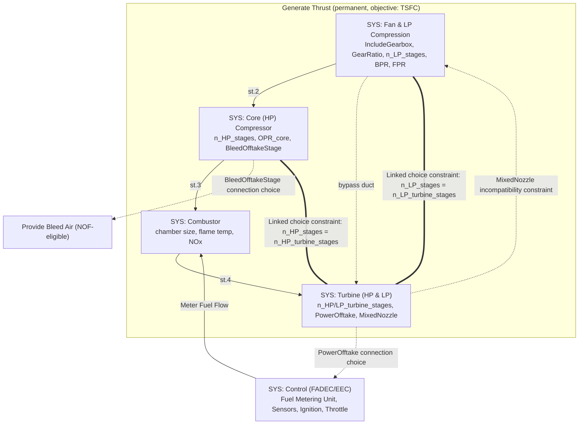

# Axioma: System Requirements Specification

**Version:** 5.0
**Status:** Draft — Phase 0 doc-consolidation pass
**Supersedes:** Axioma_requirements_v4.md
**Companion documents:** Axioma_implementation_v5.md, Axioma_test_specification_v4.md, Axioma_design_philosophy.md, Axioma_stage_tracking_amendment.md
**Change basis:** Folds v4 (Rev C, carried forward unchanged) plus the six `docs/claude/` amendment/analysis documents that had accumulated since v4 but were not yet merged: `Axioma_cameo_tutorial_gap_analysis.md` (source analysis, no spec text of its own), `Axioma_gap_closure_amendment.md` (FR-PARAM, FR-INFO, FR-INTX, FR-EXPORT, FR-CORE-10/11/12/13, amended FR-CORE-03), `Axioma_document_import_pipeline_amendment.md` (FR-CORE-14…18), `Axioma_literature_extraction.md` (citation source, no spec text of its own), `Axioma_turbofan_system_model_amendment.md` Parts 1–3 (FR-COMP-01…06, the reference ADSG system model, FR-ARCH-01…08), and `Axioma_sysml_tool_landscape_evaluation.md` (updates the ADR-011 recommendation with concrete licensing findings). This is `docs/IMPLEMENTATION_KICKOFF.md`'s **Phase 0** — a documentation-consolidation pass, no application code. Material changes are flagged inline as **[REV-D]**; earlier **[REV-B]**/**[REV-C]** flags from v4 are carried forward unchanged.

**Two collisions found and resolved during this merge** (neither was flagged completely correctly in the source amendments):
1. **ADR-011** was independently proposed by two amendments for two unrelated decisions. Resolved per the kickoff doc's own recommendation: the ADSG/SBArchOpt decision keeps **ADR-011**; the `llm-gateway`-as-shared-dependency decision is renumbered **ADR-012**. See §7 and the implementation doc §2.5.
2. **§5.14** was independently claimed by two amendments (`Axioma_gap_closure_amendment.md`'s document-import placement and `Axioma_turbofan_system_model_amendment.md` Part 1's compressor-requirements placement) for their own new design-reference section — not previously flagged anywhere. Resolved here: the documents→draft-model pipeline keeps **§5.14** (it was cross-referenced by ID from `Axioma_implementation_v5.md`'s endpoint list first); the compressor-requirements design reference moves to **§5.15**.

---

## 1. Executive Summary

**Axioma** is a cloud-native model-based systems engineering platform for building complex hardware — go from first requirements to manufacturing specifications with one connected model. It is built around a SysML v2 model graph and delivered as **two products on independent tracks** rather than one monolithic release **[REV-B §A]**. This framing matches the live copy at axioma.systems verbatim; keep both in sync:

- **Product 1 — the MBSE Platform.** A next-generation, SysML v2-native model-based systems engineering tool: requirements, architecture, safety, mission planning, traceability, simulation, and collaboration. This is a complete, sellable product on its own, comparable in scope to what competitors (e.g. Dalus) ship today. It has no dependency on the Computational Engineering Model.
- **Product 2 — the Computational Engineering Model (CEM).** A generative, physics-validated design layer that sits on top of Product 1: system-level architecture optimization (Mode B) and manufacturable part/assembly geometry synthesis (Mode C), with validation delegated to established external FEA/CFD solvers. Mode A (a grounded AI copilot) is a fast-follow bridge between the two products.

The reason for the split is dependency honesty: Mode C is genuine research-risk work (see the Leap71/Noyron precedent — years of specialized effort in a single domain), and it must not block shipping the parts that are ready. Each product is independently valuable and independently shippable.

### Why "Axioma"

An axiom is a foundational statement from which everything else is derived. Axioma is a research project built on that idea: encoding engineering knowledge — physics, manufacturing constraints, safety logic, mission requirements — as computable first principles, and deriving design consequences directly from them. This exact framing is the live copy at axioma.systems; keep this section and the site in sync going forward.

### Strategic Objectives

* **Eliminate Information Silos:** A single-source-of-truth model graph, versioned like source code.
* **Accelerate Design Cycles:** AI-augmented modeling and real-time textual/graphical sync targeting a meaningful reduction in model-entry time (measured against a baseline established during the pilot, not assumed) **[REV-B §D1 — replaced the unfounded "40%" with a measured target]**.
* **Ensure High Fidelity:** Early behavioral simulation plus, in Product 2, physics-validated geometry before anything is built.
* **Be Deployment-Ready, Not Deployment-Locked:** Support the compliance/hosting postures aerospace/defense customers require (SOC 2, GovCloud/ITAR, on-prem, EU residency) as configuration, not re-architecture (§3.4).

### Product & Release Structure **[REV-B §A]**

| Track | Scope | Depends on | Risk class |
| :--- | :--- | :--- | :--- |
| **Product 1** | Phases 1–4: graph foundation, IDE experience, digital thread, behavioral simulation, safety, mission planning | — | Delivery-risk (known engineering) |
| **Mode A fast-follow** | Grounded AI copilot over the Product 1 graph | Product 1 stable | Delivery-risk |
| **Product 2 — Mode B** | System-level architecture synthesis & trade-study optimization | Product 1 graph + Interface Contract | Delivery-risk, harder |
| **Product 2 — Mode C** | Manufacturable geometry synthesis + external validation | Mode B + `cem-geometry` kernel | **Research-risk** (explicitly) |

### Success Metrics

* Product 1 usable as a standalone MBSE tool with no CEM present.
* 100% compliance with the OMG SysML v2 API specification.
* Change-impact analysis reduced from hours to seconds, measured at target scale (§3.1).
* Zero re-architecture required to enable any compliance/deployment mode (§3.4).
* All performance NFRs continuously verified against a representative load fixture in CI (§3.1) — asserted numbers must be measured, not aspirational **[REV-B §C1]**.

---

## 2. Functional Requirements (FR)

Requirement IDs are grouped by domain and are **stable identifiers, not an ordering** — new requirements append within their group and existing IDs are never renumbered **[REV-B §D1]**. Every FR carries a traceability triplet: it links to its design section (§5–§6 here or in the implementation doc) and its test scenario (implementation doc §5). A full traceability matrix is maintained in the implementation doc §7.

### 2.1 Core Platform (Product 1)

| ID | Requirement Name | Description | Design | Test |
| :--- | :--- | :--- | :--- | :--- |
| **FR-CORE-01** | Standardized API | 100% compliance with the OMG Systems Modeling API & Services v1.0 standard. | impl §1 | impl §5 |
| **FR-CORE-02** | Dual-Notation Sync | Real-time bi-directional sync between SysML v2 Textual Notation (LSP-based) and Graphical Diagrams. **[REV-D]** No open-source SysML v2 tool has yet solved *live* graphical↔textual sync — flagged as a genuine delivery-risk item, not a routine one, per the tool-landscape evaluation (§1.3 there). | impl §4.3 | impl §5 |
| **FR-CORE-03** | Graph Traceability | n-degree relationship maps (`Satisfy`, `Verify`, `Refine`, and, **[REV-D]**, `Derive`/`Copy` — see the amended edge list below) across the model, via graph-query languages, subject to the query budgets in NFR-PERF-04. | §5.3 | impl §5 |
| **FR-CORE-04** | Behavioral Simulation | Discrete-event simulation of State Machines and Activity Diagrams. Execution-engine build-vs-adopt is an open ADR (§7); full f-UML/Alf compliance is not assumed **[REV-B §D3]**. | impl §4.5 | impl §5 |
| **FR-CORE-05** | Semantic Validation | A server-authoritative validation pass enforces model invariants (valid relationship endpoints, containment acyclicity, parametric consistency) independently of the collaboration layer. See §5.1 **[REV-B §B1]**. | §5.1 | impl §5 |
| **FR-CORE-06** | Collaborative Editing | Conflict-free convergent editing (CRDT) with no package locking. Convergence is distinct from validity — see FR-CORE-05 and §5.1 **[REV-B §B1]**. | §5.1 | impl §5 |
| **FR-CORE-07** | Model Import / Interop | First-class import from ReqIF (requirements) and the SysML v2 standard API (model interchange), plus an AI-assisted "documents → draft model" path (fully specified as FR-CORE-14…18, §5.14 **[REV-D]**). Migration off Cameo is a named, designed capability, not an afterthought **[REV-B §E3]**. | impl §4.4 | impl §5 |
| **FR-CORE-08** | Provenance & Confidence Model | Every element records origin (human / AI-suggested / AI-auto-merged), validation state, and staleness, queryable graph-wide and surfaced visually. See §6.2 and FR-CEM-04 **[REV-B §E2]**. | §6, impl §6.x | impl §5 |
| **FR-CORE-09** | Alf Authoring (Minimal Subset) | Behavioral action code may be authored in a minimal, in-house subset of OMG Alf (`alf-lite`), compiled to fUML for execution. Clean-room (public spec only; no GPL Alf RI code); scoped to the pilot's constructs and grown on demand. See impl §9.6 **[REV-B §D3]**. | impl §9.6 | impl §5 |
| **FR-CORE-10** | Saved Dynamic Queries **[REV-D]** | A user can define a named, saved graph query (e.g., "all Blocks with stereotype `subsystem` under Package X") whose result set is live — re-evaluated on demand or on a defined refresh trigger — and can be pinned into the Browser/navigation tree alongside statically-organized content. | §5.13 | impl §5 |
| **FR-CORE-11** | Static Snapshot Collections **[REV-D]** | A Dynamic Query result can be frozen into a static, manually-curated collection (add/remove members by hand, no further live re-evaluation) — the equivalent of Cameo's "Freeze Contents." | §5.13 | impl §5 |

**[REV-D, implemented `docs/IMPLEMENTATION_KICKOFF.md` Phase 5 — see impl v5 §13 for full detail]:** FR-CORE-10/11 are built as `POST /collections/dynamic` (saves a query definition, rejected at save time if over NFR-PERF-04's budget) and `POST /collections/{id}/freeze` (re-runs the same budgeted traversal `/elements/{id}/traceability` already uses, materializing a real `:Collection` + `Member` edges). On-demand evaluation only — no scheduled/on-write-triggered re-evaluation policy yet (needs a job scheduler, Product-2-scoped), a deliberate scope-down, not a silent drop.

| **FR-CORE-12** | Swimlane/Partition Allocation **[REV-D]** | An Activity-equivalent behavioral diagram supports partitioning its canvas by structural element (Block/Actor/Interface), with each partition allocated to exactly one structural element, so an Action's owner is visually and semantically explicit — not just inferable from a hyperlink. | §5.11 | impl §5 |

**[REV-D, real gap found during Phase 5 scoping, not built]:** this row's own §5.11 design text assumes "no backend data-model change beyond the existing `Allocate` dependency stereotype already implied by FR-CORE-03's dependency taxonomy" — but no `Allocate` `EdgeKind` was ever actually added in Phase 1 (`packages/sysml-core/src/lib.rs`'s `EdgeKind` enum has no such variant). FR-CORE-12 is therefore still fully unbuilt, not partially — flagged rather than guessed at.
| **FR-CORE-13** | Control/Object Flow Validity **[REV-D]** | The semantic-validation layer (FR-CORE-05) rejects an Action with no incoming or outgoing flow path ("orphan Action") and rejects a Decision node with more than one outgoing flow whose guard can evaluate `True` simultaneously, consistent with SysML's well-formedness rules for Activities. | §5.1 (amended) | impl §5 |
| **FR-CORE-14** | Document Requirement Extraction **[REV-D]** | Given an uploaded document (PDF at minimum; OCR applied if scanned/image-based), the platform extracts candidate requirement statements and drafts each as a `Requirement` element with name, ID, "shall"-text, and a best-effort category. Extraction runs as an asynchronous job, not a blocking request. | §5.14 | impl §5 |
| **FR-CORE-15** | Document Citation Provenance **[REV-D]** | Every `Requirement` element created by FR-CORE-14 carries a citation back to its source location in the originating document (at minimum: page number; paragraph/offset where extractable), in addition to the standard AI-generation provenance (FR-CORE-08). A Requirement with no citation is a defect, not an acceptable degraded case. | §5.14 | impl §5 |
| **FR-CORE-16** | Document Import Review Gate **[REV-D]** | A completed document-extraction job produces a reviewable proposal — never a direct write to Main — using the same proposal/branch review-gate mechanism as CEM-generated changes (FR-CEM-07) and human-authored edits (FR-PM-05), generalized to accept a third proposal origin, `document-import`. One review-gate mechanism, three origins; no new parallel approval pipeline. | §5.6 (amended), §5.14 | impl §5 |
| **FR-CORE-17** | Candidate Structure Suggestions (Non-Binding) **[REV-D]** | The extraction job may additionally surface candidate structural nouns (subsystem/component names mentioned in the document) as unlinked suggestions in the review UI. These are display-only hints, never persisted as `Structure`/Block elements automatically — a human must explicitly create or link a Block for a suggestion to become real model content. | §5.14 | impl §5 |
| **FR-CORE-18** | Extraction Failure & Low-Confidence Handling **[REV-D]** | The extraction job reports, per candidate requirement, a confidence signal and surfaces (rather than silently drops) statements it could not confidently structure. A document that yields zero extractable requirements is a reported failure state, not an empty successful import. | §5.14 | impl §5 |

**[REV-D, implemented `docs/IMPLEMENTATION_KICKOFF.md` Phase 5 — see impl v5 §13]:** FR-CORE-16's review-gate UI now surfaces `origin` at all — `AutonomyPanel.tsx`'s `Proposal` type previously didn't declare the field even though the API has returned it since Phase 1, so the client silently discarded it. Now rendered as a badge plus an origin filter. FR-CORE-14…18 themselves (the document-import pipeline that would actually *produce* a `document-import`-origin proposal) remain unbuilt — the `document-import`/`human-authored` filter options are real and functional, they just legitimately show nothing yet.

### 2.2 Computational Engineering Model — CEM (Product 2)

The CEM is a two-tier generative system over the Product 1 graph: **Mode B** operates on the systems-architecture graph, **Mode C** generates and validates physical geometry. **Mode A** is the grounded copilot bridging them. Architecture in §5. **[REV-D]** Mode B's own architecture-*generation* design-space representation — what it actually searches over — is now specified separately as FR-ARCH (§2.11, §5.17); FR-CEM-02 below states the capability, FR-ARCH states the underlying model.

| ID | Requirement Name | Description | Design | Test |
| :--- | :--- | :--- | :--- | :--- |
| **FR-CEM-01** | Grounded Retrieval (Mode A) | Answer engineering questions from the model graph plus an external corpus, every claim citing a source. | §5.2 | impl §5 |
| **FR-CEM-02** | Architecture Synthesis (Mode B) | From top-level requirements, generate/optimize allocation of Blocks and interfaces across subsystems via 0D/1D performance and mass-budget models. **[REV-D]** See FR-ARCH (§2.11) for the design-space representation this searches over. | §5.2, §5.17 | impl §5 |
| **FR-CEM-03** | Validation Gate | Every generated candidate passes an appropriate validation gate before being tagged `Validated`. The gate result is not binary — see the solver-result states in §5.4 and FR-CEM-13 **[REV-B §B3]**. | §5.4 | impl §5 |
| **FR-CEM-04** | Auto-Traceability & Provenance | Generated elements create `Satisfy`/`Verify`/`Refine` edges to their source, tagged `source: ai-generated`, and carry full generation provenance (FR-CEM-05). | §5.2 | impl §5 |
| **FR-CEM-05** | AI Generation Provenance | Every LLM-driven generation records model name, version, prompt-template hash, temperature/seed, and a context snapshot — the LLM analog of `SimulationRun` provenance **[REV-B §B4]**. | §5.2 | impl §5 |
| **FR-CEM-06** | Continuous Feedback Ingestion | Real test/simulation outcomes feed future generations for that element type. | §5.4 | impl §5 |
| **FR-CEM-07** | Configurable Review Gate | Review strictness before merge is governed by the Autonomy Level (FR-CEM-16); no level bypasses FR-CEM-03. | §5.6 | impl §5 |
| **FR-CEM-08** | Interface Contract | Mode B emits a structured Interface Contract per subsystem as the spec Mode C consumes. **[REV-D]** Extended with compressor-specific worked examples, impl §2.6. | §5.3 | impl §5 |
| **FR-CEM-09** | Geometry Synthesis (Mode C) | From an Interface Contract, generate manufacturable geometry, validated externally (§5.4). | §5.4 | impl §5 |
| **FR-CEM-10** | Assembly Composition | Mode C composes mating parts into valid assemblies/sub-assemblies respecting the Interface Contract's ports. | §5.4 | impl §5 |
| **FR-CEM-11** | Bidirectional MDO Feedback | Mode C actuals write back to Block properties; material deviation flags dependents `Suspect`. Whether that auto-triggers re-optimization is governed by the Autonomy Level (FR-CEM-16). | §5.6 | impl §5 |
| **FR-CEM-12** | FEA/CFD Connector Framework | Provider-agnostic interface for submitting jobs (structural FEA, CFD, thermal) to external solvers; no vendor hard-wired. Generation stays proprietary; validation is delegated. | §5.4 | impl §5 |
| **FR-CEM-13** | Solver Result States | Solver outcomes are typed (`Converged`, `Diverged`, `Failed`, `Timeout`, `Suspect-Numerical`, `LicenceUnavailable`), with a plausibility check before any graph write. Only `Converged`-within-bounds may satisfy an autonomy gate; all else drops to human review **[REV-B §B3]**. | §5.4 | impl §5 |
| **FR-CEM-14** | Multi-Run Simulation Campaigns | Batches of runs (varying geometry, BCs, or candidates) dispatched in parallel via a governed job scheduler (NFR-PERF-05) across configured solvers, at Part / Subsystem / System level. | §5.4 | impl §5 |
| **FR-CEM-15** | Comparative Design Evaluation | Campaign results compared against Interface Contract targets and each other (e.g. Pareto front on mass/stress/cost), surfaced or fed back to Mode B/C. | §5.4 | impl §5 |
| **FR-CEM-16** | Configurable Autonomy Levels | An ordered set of autonomy levels (L0–L4) for CEM-driven change, mirroring AI coding-assistant conventions. Defined in §5.6. | §5.6 | impl §5 |
| **FR-CEM-17** | Scoped Autonomy Configuration | Autonomy Level is set per project/branch and overridable per element-type/subsystem — not a single global switch. | §5.6 | impl §5 |
| **FR-CEM-18** | Safety Override (Non-Negotiable) | No autonomy level allows an element linked to an unmitigated Hazard, or a High/Catastrophic Hazard (FR-SAFE-02), to merge without individual human review. Cannot be configured away. | §5.6 | impl §5 |
| **FR-CEM-19** | Result Provenance & Traceability | Each solver run's metrics write back via a `validatedBy` edge to a `SimulationRun` node recording solver/version/settings/input-hash/timestamp; large result files referenced by pointer, not stored in the graph (NFR-DATA-02). | §5.4 | impl §5 |

### 2.3 System Safety & Hazards (Product 1)

| ID | Requirement Name | Description | Design | Test |
| :--- | :--- | :--- | :--- | :--- |
| **FR-SAFE-01** | Hazard Identification | `Hazard` nodes linked to Blocks/Functions/Requirements via `causes`/`mitigatedBy`. | impl §4.3 | impl §5 |
| **FR-SAFE-02** | Risk Assessment Matrix | Configurable Severity × Likelihood scales (e.g. 5×5, MIL-STD-882 / ARP4761 conventions), auto-computed Risk Index. | impl §4.3 | impl §5 |
| **FR-SAFE-03** | Mitigation/Control Tracking | Controls linked to Hazards; residual risk and status (Open / Mitigated / Accepted). | impl §4.3 | impl §5 |
| **FR-SAFE-04** | Safety Traceability | Hazards/Controls participate in the same traceability graph (FR-CORE-03). | §5.3 | impl §5 |
| **FR-SAFE-05** | Standards-Aligned Reporting | Export a Hazard/Risk register formatted for ARP4761 / MIL-STD-882 / ISO 26262. **[REV-D]** Reuses the same report-template mechanism as the general FR-EXPORT-03 (§2.9) — one template pipeline, not a safety-specific-only one. | impl §4.4 | impl §5 |

### 2.4 Mission Planning (Product 1)

| ID | Requirement Name | Description | Design | Test |
| :--- | :--- | :--- | :--- | :--- |
| **FR-MSN-01** | Mission/Use-Case Definition | `Mission`/`UseCase` elements at the top of the hierarchy, deriving Requirements. | impl §4.3 | impl §5 |
| **FR-MSN-02** | Stakeholder Management | Stakeholders, concerns, and links to owned Missions/Requirements. | impl §4.3 | impl §5 |
| **FR-MSN-03** | Program Phase Tracking | Lifecycle phases (Concept → Development → Production → Operations → Disposal) as a timeline overlay. | impl §4.3 | impl §5 |
| **FR-MSN-04** | Mission-to-Requirement Traceability | Traceability extends upward: Missions → Requirements → Blocks. | §5.3 | impl §5 |

### 2.5 Program & Subsystem Lifecycle Tracking (Product 1) **[REV-C]**

Full rationale, status vocabularies, and open-decision flags for this group are maintained in `Axioma_stage_tracking_amendment.md`; this table is the stable-ID summary.

| ID | Requirement Name | Description | Design | Test |
| :--- | :--- | :--- | :--- | :--- |
| **FR-PM-01** | Subsystem Stage Tracking | Each `Block` (subsystem) carries a current stage from the ordered set: Requirements Definition → Preliminary Design → Detailed Design → Prototype Fabrication → Testing, each with its own controlled status vocabulary. | §5.8 | impl §5 |
| **FR-PM-02** | Program Phase Rollup | Program Phase (FR-MSN-03: Concept → Development → Production → Operations → Disposal) is computed, not manually set, as the minimum phase implied by all subsystems' current stages (§5.8 mapping table). The program cannot advance past a phase until every subsystem has cleared the stages mapped to it. | §5.8 | impl §5 |
| **FR-PM-03** | Computed Stage Progress | Each subsystem's per-stage and overall progress percentage is computed from underlying model state, never manually entered, per the rules in §5.8. Where a stage has no model-graph proxy for physical progress (Prototype Fabrication), this is an explicit, documented approximation, not silently treated as ground truth. | §5.8 | impl §5 |
| **FR-PM-04** | Testing Stage Status Derivation | Testing-stage status per subsystem is derived from, and stays consistent with, the `SimulationRun`/solver-result provenance already recorded per FR-CEM-19 and the element Validation state (§6.2) — not an independently-editable field. | §5.8, §6.2 | impl §5 |
| **FR-PM-05** | Unified Review Gate | Requirements Definition and design-stage approvals ("In Review" → "Approved") use the same proposal/branch review-gate mechanism as CEM-generated changes (FR-CEM-07, `/cem/proposals/*`), generalized to accept human-authored Requirement/Block edits as a proposal type — not a second, parallel approval mechanism. **[REV-D]** §5.6 now generalizes this further to a third origin, `document-import` (FR-CORE-16) — one mechanism, three origins. | §5.6 (amended), §5.8 | impl §5 |

### 2.6 Parametrics (Product 1) **[REV-D, new group FR-PARAM]**

*Why this is Product 1, not CEM:* Parametrics is one of the four SysML pillars (Structure, Behavior, Requirements, Parametrics) and is used for lightweight engineering calculations (mass budgets, margins, unit conversions) *before* and *independent of* whether Mode B's deterministic optimizer or Mode C's external solvers are ever invoked. Making this CEM-only would force every Product-1-only customer into the CEM track for basic engineering math, contradicting "Product 1 usable as a standalone MBSE tool with no CEM present" (§1, Success Metrics).

| ID | Requirement Name | Description | Design | Test |
| :--- | :--- | :--- | :--- | :--- |
| **FR-PARAM-01** | Constraint Definition | A user can define a reusable Constraint (an equation or inequality over named parameters) independent of any specific element, stored in a Model Library-equivalent location in the graph. | §5.9 | impl §5 |
| **FR-PARAM-02** | Parametric Binding | A user can bind a Constraint's parameters to Value Properties of one or more structural elements via typed Binding relationships; the binding enforces type/unit consistency at bind time, not just at evaluation time. | §5.9 | impl §5 |
| **FR-PARAM-03** | Parametric Evaluation | Given concrete input values, the platform evaluates all bound Constraints for an element or subgraph and returns computed values for derived parameters, without invoking `cem-core` or any solver — this is direct algebraic/numeric evaluation, distinct from Mode B optimization (FR-CEM-02) and from external FEA/CFD validation (FR-CEM-12). | §5.9 | impl §5 |
| **FR-PARAM-04** | Parametric Traceability | Every Constraint and Binding is a first-class graph element and participates in traceability (FR-CORE-03) — e.g., "which Requirements are supported by this Constraint" is answerable the same way Satisfy/Verify queries are. | §5.9, §5.3 | impl §5 |

**[REV-D, implemented `docs/IMPLEMENTATION_KICKOFF.md` Phase 5 — see impl v5 §13]:** FR-PARAM-01/02/04 were already fully covered by the generic `POST /elements`/`POST /edges` endpoints (any `NodeKind`/`EdgeKind`, including `Constraint`/`Parameter`/`Bound`) — no dedicated `/parametrics/constraints`/`/parametrics/bindings` endpoint was built, since one would be a pure wrapper duplicate. FR-PARAM-03 (`POST /parametrics/evaluate`) is built as a tabulated-lookup interpolator over a Constraint's `sampledPointsAtDesignSpeed` data (Phase 3's real content), not a general expression parser — reqs v5 doesn't concretely specify an expression grammar.

### 2.7 Information/Data Architecture (Product 1) **[REV-D, new group FR-INFO]**

*Naming note:* `FR-INFO` is kept distinct from `NFR-DATA` on purpose — `NFR-DATA-01/02` govern how the platform **stores** element bodies; `FR-INFO` governs the user-facing capability to **model** a system's information architecture as SysML content, same as Cameo's Data Package / CDM-LDM-PDM.

| ID | Requirement Name | Description | Design | Test |
| :--- | :--- | :--- | :--- | :--- |
| **FR-INFO-01** | Information Element Modeling | A user can define information/data entities as typed structural elements (SysML v2's data-definition equivalent), organized into a dedicated information-architecture view distinct from the physical/behavioral structure view. | §5.10 | impl §5 |
| **FR-INFO-02** | Data Type & Enumeration Definition | A user can define custom Data Types and Enumerations (name + literal set), in addition to a built-in primitive set (boolean, integer, real, string, and unit-bearing numeric types). | §5.10 | impl §5 |
| **FR-INFO-03** | Conceptual → Logical Refinement | Information elements support an explicit abstraction-level tag (Conceptual / Logical / Physical, or equivalent) and a `Refine`/`Specialize` relationship between levels, so a Conceptual entity's Logical realizations are traceable — mirroring CDM→LDM→PDM without mandating the exact three-tier vocabulary. | §5.10 | impl §5 |
| **FR-INFO-04** | Information Flow Typing | Object/Item Flows between behavioral elements (Activities, Ports) are typed by an Information Element or Data Type defined per FR-INFO-01/02, so flow content is traceable back to the information model rather than left as an untyped label. | §5.10, §5.11 | impl §5 |

**[REV-D, implemented `docs/IMPLEMENTATION_KICKOFF.md` Phase 5 — see impl v5 §13]:** FR-INFO-01/03 are built as `POST /information/elements` (`{name, abstractionLevel}` — a real `:InformationElement` with its tier set in one call/commit). FR-INFO-02 (`/information/data-types`) isn't built separately — no `:DataType` `NodeKind` exists; a Data Type is itself just an `:InformationElement`, already covered by the same endpoint. FR-INFO-04 remains unbuilt (needs Interaction/Object-Flow modeling, ADR-009-blocked, deferred with Interactions).

### 2.8 Interaction / Cross-Element Timing Behavior (Product 1) **[REV-D, new group FR-INTX]**

**Open ADR (ADR-009):** the concrete SysML v2 metaclass(es) backing FR-INTX-01…04 are not yet chosen — see §5.11 and §7.

| ID | Requirement Name | Description | Design | Test |
| :--- | :--- | :--- | :--- | :--- |
| **FR-INTX-01** | Message-Based Interaction Modeling | A user can model a time-ordered exchange of messages/invocations among a defined set of structural elements (the SysML v2-native equivalent of a UML Sequence Diagram/Interaction) — showing who calls what, in what order, without requiring a full State Machine or Activity to express it. | §5.11 | impl §5 |
| **FR-INTX-02** | Timing Constraints on Interactions | An Interaction can carry minimum/maximum absolute-time and duration constraints between two points in the exchange, usable for early, pre-simulation timing/latency analysis. | §5.11 | impl §5 |
| **FR-INTX-03** | Conditional/Repeated Sub-Interactions | An Interaction supports at minimum: an alternative-branch construct (mutually exclusive guarded sub-sequences), an optional sub-sequence, a parallel sub-sequence, and a loop sub-sequence — covering the common cases from SysML v1's Combined Fragment operators (`alt`/`opt`/`par`/`loop`) even if the underlying SysML v2 construct differs. | §5.11 | impl §5 |
| **FR-INTX-04** | Reusable Sub-Interactions | A named Interaction can be referenced from within another Interaction as a reusable sub-sequence (the SysML v2-native equivalent of an Interaction Occurrence/`ref` fragment), so common exchange patterns are defined once. | §5.11 | impl §5 |

### 2.9 Export & Reporting (Product 1) **[REV-D, new group FR-EXPORT]**

| ID | Requirement Name | Description | Design | Test |
| :--- | :--- | :--- | :--- | :--- |
| **FR-EXPORT-01** | Diagram Image Export | Any canvas view (BDD-equivalent, behavioral diagram, or Interaction) can be exported as a static image (PNG/SVG at minimum) at the current viewport or full-diagram extent, for use outside the tool (reports, decks). | §5.12 | impl §5 |
| **FR-EXPORT-02** | Tabular Export | Any generated table view (Requirements Table, Generic Element Table, traceability matrix) can be exported to a spreadsheet-compatible format (CSV/XLSX), preserving column selection and applied filters. | §5.12 | impl §5 |
| **FR-EXPORT-03** | Model Report Generation | A user can generate a structured document (at minimum: PDF or HTML) summarizing a selected scope of the model — e.g., a Use Case with its Specification and scenario, or a Block with its Requirements and Hazards — extending the existing FR-SAFE-05 standards-export mechanism to non-safety content. One template mechanism, multiple report types. | §5.12 | impl §5 |
| **FR-EXPORT-04** | Element File Attachments | Any model element can have one or more external files (spec sheets, drawings, point-design data) attached and hyperlinked, retrievable via the element's API representation; attachments are stored in the object store per NFR-DATA-02, never inlined in the graph or document store. | §5.12 | impl §5 |

### 2.10 Compressor Subsystem Requirements (Product 1, pilot-specific) **[REV-D, new group FR-COMP]**

Applies identically to both compressor subsystems (Fan & LP Compression, Core (HP) Compressor) — each gets its own independent copy of these requirements, populated with subsystem-specific values (see §5.16's `SYS` grouping-node treatment).

| ID | Requirement Name | Description | Design | Test |
| :--- | :--- | :--- | :--- | :--- |
| **FR-COMP-01** | Over-all Design-Point Specification | Every compressor-subsystem Block carries a structured 9-field design-point specification (weight flow, over-all pressure ratio, equivalent speed, target efficiency, high-efficiency operating range, inlet/outlet diameters, max outlet velocity, length/weight targets, inlet distortion tolerance), populated by a human or by Mode B (tagged `source: ai-generated` per FR-CEM-04). | §5.15 | *not yet specified — Phase 6* |
| **FR-COMP-02** | Off-Design Performance Map | Every compressor-subsystem Block carries a performance-map artifact (pressure ratio vs. equivalent weight flow, parametrized by equivalent speed, with an explicit stall/surge limit line) as the canonical representation of off-design behavior — not just the single design point from FR-COMP-01. | §5.15 | *not yet specified — Phase 6* |
| **FR-COMP-03** | Blade-Loading & Mach Validation | The semantic-validation layer (FR-CORE-05) rejects a compressor-subsystem configuration whose stage loading (diffusion factor) or relative Mach number falls outside stated bounds without an explicit, human-acknowledged override — default bounds: diffusion factor ≲ 0.4, relative Mach number ≤ 1.2 (routine); values up to Mach 1.35 or D > 0.4 are accepted only with an explicit override flag, never silently. | §5.15 | *not yet specified — Phase 6* |
| **FR-COMP-04** | Stage-Count Consistency | A compressor subsystem's stage count is linked, via a choice constraint (§5.16), to the stage count of the turbine section that drives it — Fan & LP Compression ↔ LP Turbine, Core (HP) Compressor ↔ HP Turbine — so Mode B cannot generate an architecture instance with an inconsistent stage split across a shaft. | §5.16 | *not yet specified — Phase 6* |
| **FR-COMP-05** | Gas-Generator Matching Interface | A compressor-subsystem Block exposes, at its ports, the parameters needed for 0D/1D gas-generator matching against the Combustor and its driving Turbine: equivalent weight flow, equivalent speed, bleed fraction `B`, and (for Core (HP) Compressor) the station-numbering convention in §5.16. | §5.16 | *not yet specified — Phase 6* |
| **FR-COMP-06** | Negotiable-Specification Flagging | If two or more fields of a compressor subsystem's FR-COMP-01 specification are found mutually incompatible (e.g., requested pressure ratio not achievable within the stated length/weight budget at the stated stage count), the specification is flagged for review, not silently adjusted or silently accepted. | §5.15 | *not yet specified — Phase 6* |

**[REV-D]** FR-COMP-01/02 are not already covered by the generic Interface Contract "Performance targets" field (impl §2.6) — a compressor needs a specific, named 9-field structure plus a map artifact, not a free-text blob, because off-design behavior (stall margin, Reynolds-number effects, inlet distortion) is where compressor designs actually fail.

**[REV-D, implemented `docs/IMPLEMENTATION_KICKOFF.md` Phase 3 — see impl v5 §11 for full detail]:** FR-COMP-01/02/05/06 are seeded as real content on `Turbofan-Ref` (`REQ-FAN-SPEC`/`REQ-CORE-SPEC` Requirements, `:Constraint`/`:Parameter` off-design content, `:Port` gas-generator-matching elements, negotiable/flagged body properties), plus the Interface Contract worked examples (impl §2.6) merged onto both subsystems. FR-COMP-03 is validated (`sysml_core::check_compressor_blade_loading`, pure and unit-tested) but **not yet HTTP-enforced** — no generic body-mutation endpoint validates kind-specific content today; wiring is Phase 5's API-surface job. FR-COMP-04 remains explicitly deferred to Phase 4 (needs Turbine-side content outside this phase's compressor-only scope). Test column entries above are unchanged — `T-COMP-*` rows genuinely don't exist yet (Phase 6).

### 2.11 Mode B Architecture Design-Space Representation (Product 2 / CEM) **[REV-D, new group FR-ARCH, extends §2.2]**

**Headline finding this group exists to close:** FR-CEM-02 states Mode B "generates/optimizes allocation of Blocks and interfaces... via 0D/1D performance and mass-budget models" but, before this revision, nowhere specified the design-space representation Mode B actually searches over. This is not a small gap — comparable in scope to the fUML/Alf decision already made for behavioral simulation (ADR-005) — and should not be assumed to fit inside the existing P2.1 timeline without re-estimating it once ADR-011 (§7) is resolved.

| ID | Requirement Name | Description | Design | Test |
| :--- | :--- | :--- | :--- | :--- |
| **FR-ARCH-01** | Function-to-Form Modeling | A user (or Mode B, drafting) can model architecture-generation functions (`FUN`) and their fulfillment via component (`COMP`), decomposition (`DE`), multi-fulfillment (`MULTI`), non-fulfillment (`NOF`), or concept-narrowing (`CON`) nodes, distinct from fUML Actions used for behavioral execution (FR-CORE-04). | §5.17 | *not yet specified — Phase 6* |
| **FR-ARCH-02** | Selection Choice Modeling | A user can define a selection choice (pick-one-of-N) over option nodes, with derivation edges expressing "if selected, these elements exist," including cyclic derivation (e.g., mutually-dependent Compressor/Combustor/Turbine existence). | §5.17 | *not yet specified — Phase 6* |
| **FR-ARCH-03** | Connection Choice Modeling | A user can define a connection choice between a set of source ports and target ports, with cardinality rules (list/range/lower-bound-only), resolved after selection choices. | §5.17 | *not yet specified — Phase 6* |
| **FR-ARCH-04** | Incompatibility & Choice Constraints | A user can define an incompatibility constraint (mutual exclusion) between two elements/choices, or a choice constraint (Linked/Permutations/Unordered [non-]replacing combinations) across a set of choices. | §5.17 | *not yet specified — Phase 6* |
| **FR-ARCH-05** | Design Vector Encode/Decode | `cem-core` can encode a resolved (or partially resolved) architecture into a design vector and decode a design vector back into a graph instance, using problem-specific correction by default with a generic fallback available. | §5.17 | *not yet specified — Phase 6* |
| **FR-ARCH-06** | Design-Space Health Metrics | `cem-core` computes and exposes Imputation Ratio, Correction Ratio, Correction Fraction, and Max Rate Diversity for any defined design space, before an expensive optimization run is launched. | §5.17 | *not yet specified — Phase 6* |
| **FR-ARCH-07** | Architecture Instance Generation & Comparison | Mode B runs produce a browsable, comparable set of architecture instances (candidate Blocks/subgraphs), each carrying the same provenance as any other AI-generated element (FR-CEM-04/05) and enterable into the existing proposal/review-gate flow (`/cem/proposals/*`, FR-CEM-07) — not a separate approval mechanism. | §5.17 | *not yet specified — Phase 6* |
| **FR-ARCH-08** | Non-Convergent Evaluation Handling | When a candidate architecture's evaluation does not converge, `cem-core` treats this as a typed, non-fatal outcome usable by the optimizer (e.g., a Probability-of-Viability signal) rather than a hard failure — reusing the existing solver-result-state pattern from FR-CEM-13 rather than inventing a second failure taxonomy. | §5.17 | *not yet specified — Phase 6* |

---

## 3. Non-Functional Requirements (NFR)

Unchanged from v4 — no amendment reviewed for this revision proposes a new or amended NFR.

### 3.1 Performance & Scale **[REV-B §C1]**

* **NFR-PERF-01 (Canvas rendering):** Render 10,000+ *visible* elements at 60 FPS via WebGPU. Beyond that, the canvas uses viewport virtualization and level-of-detail — off-screen subsystems are clustered/collapsed, not held as live nodes. "WebGPU" is the rendering backend; virtualization is the data-volume strategy (impl §4.3).
* **NFR-PERF-02 (Interaction latency):** UI feedback for element creation < 50 ms; backend partial-graph persistence p95 < 200 ms *at target scale*.
* **NFR-PERF-03 (Model scale):** Support > 1 million elements. This is the backend-traversal target and is meaningful only with NFR-PERF-04 in force.
* **NFR-PERF-04 (Query budgets):** Traversal/traceability endpoints enforce max depth, max fan-out, and result caps with cursor-based pagination. GDS projections are scoped to a subgraph, never the whole model. Each endpoint declares a p95 latency target *at 1M-element scale*.
* **NFR-PERF-05 (Campaign resource governance):** Solver Campaigns run under a job scheduler with per-project concurrency limits, quotas, cost ceilings, retry/back-off, and cancellation. An autonomous (L4) loop cannot launch an unbounded or unbudgeted Campaign **[REV-B §C3]**.
* **NFR-PERF-06 (Continuous load verification):** A synthetic 1M-element reference model is maintained as a CI fixture; NFR-PERF-01/02/03/04 are measured against it on every release, not merely asserted.

### 3.2 Reliability & Data Integrity **[REV-B §B]**

* **NFR-REL-01 (Convergence vs. validity):** The collaboration layer guarantees all clients converge to the same state; a separate server-authoritative pass (FR-CORE-05) guarantees that state is *valid*. An illegal converged state is quarantined and surfaced as a conflict — never silently persisted. §5.1 defines the policy.
* **NFR-REL-02 (Graph topology):** The model is a **directed property graph**, not a DAG. Acyclicity is enforced only on the containment/composition hierarchy; traceability, feedback (`validatedBy`), and `Suspect` propagation are expected to form cycles. Algorithms must not assume global acyclicity **[REV-B §B2]**. **[REV-D]** The new `derives` edge (§5.17, FR-ARCH) explicitly permits cycles too — mutually-dependent architecture-choice derivation is a legitimate, expected shape, not a bug.
* **NFR-REL-03 (Solver trust):** External solver results are never trusted blindly; FR-CEM-13's result states and plausibility checks gate every write from a solver.
* **NFR-REL-04 (Backup / DR):** The graph, the document store, and the Git-backed model store have defined backup cadence and stated RPO/RTO recovery objectives **[REV-B §F]**.
* **NFR-REL-05 (Schema migration):** Evolution of the KerML schema or node definitions (`Hazard`, `Mission`, etc.) is supported by a versioned, tested graph-migration mechanism; migrating millions of existing nodes is a planned capability, not an incident **[REV-B §F]**.

### 3.3 CEM-Specific

* **NFR-CEM-01 (Latency):** Mode A query < 5 s; Mode B trade studies evaluate many candidate architectures per session (funnel efficiency, NFR-CEM-05).
* **NFR-CEM-02 (Determinism, scoped):** The deterministic optimizer (`cem-core`) and pinned external solvers are reproducible given identical inputs; solver reproducibility is scoped to a pinned solver name+version+settings on the `SimulationRun`. LLM-driven output (Mode A, drafting) targets "explainably similar," not bit-identical, and records the provenance in FR-CEM-05 to make that auditable **[REV-B §B4]**.
* **NFR-CEM-03 (Data Isolation):** Zero training on customer/proprietary data by default; on-prem/local-LLM supported.
* **NFR-CEM-04 (Provenance):** Every AI-sourced edge or claim carries a citation — no exceptions.
* **NFR-CEM-05 (Funnel Efficiency):** Mode B stays cheap enough to explore broadly; Mode C is invoked only for narrowed subsystems.
* **NFR-CEM-06 (Autonomy Auditability):** Every change to an Autonomy Level is itself logged (actor, timestamp, old/new).

### 3.4 Compliance & Deployment Readiness

Positioning unchanged from v2.0: SOC 2 Type 2, AWS GovCloud (ITAR/EAR), on-prem, and EU Data Residency are **optional modes activated later**, but the architecture must not require a rewrite to enable them.

* **NFR-COMP-01 (Deployment Portability):** No hard dependency on a single cloud vendor's proprietary services in the core data/compute path.
* **NFR-COMP-02 (Data Residency):** Data layer supports per-tenant/per-project region pinning from day one.
* **NFR-COMP-03 (Auth Abstraction):** Authentication behind a provider-agnostic interface; the LLM provider is behind the same kind of interface (§5.5) so local vs. hosted is a config choice **[REV-B §D4]**.
* **NFR-COMP-04 (Audit-Readiness):** All writes logged with actor/timestamp/diff (the Git-backed MVS + change-tracking middleware). Distinct from operational observability (NFR-OPS-01).
* **NFR-COMP-05 (Isolation-Ready Segmentation):** Supports a fully isolated single-tenant instance per customer/project.

### 3.5 Operability & Security Defaults **[REV-B §F]**

* **NFR-OPS-01 (Observability):** Every service (`sysml-core`, `cem-core`, `cem-geometry`, `cem-connectors`, LSP, collaboration server) emits distributed traces, metrics, and structured logs. This is operational telemetry, distinct from the compliance audit log (NFR-COMP-04).
* **NFR-OPS-02 (Multi-tenancy default):** The *default* shared deployment specifies exactly how project A's data is isolated from project B's (row/graph-level tenancy keys, enforced in the data-access layer). This is a security-critical default, not an edge case; single-tenant isolation (NFR-COMP-05) is the stricter variant, not the only defined one.
* **NFR-OPS-03 (Rate & abuse limits):** LLM and solver endpoints are rate-limited and quota-bound, especially when invoked programmatically by autonomy loops.
* **NFR-OPS-04 (Generative-path concurrency):** A defined policy governs overlapping writes on the same subsystem — concurrent Campaigns, or Mode C writing while a human edits the same Block. §5.7.

---

## 4. Technology Stack (Summary)

Full detail and rationale in the implementation doc §2; **the ADR log (impl §2.5) is the single source of truth for technology choices** and supersedes any offhand mention elsewhere **[REV-B §D2]**.

| Layer | Technology | Notes |
| :--- | :--- | :--- |
| Frontend | React 19 + Next.js + React Flow | **Single frontend stack. All SvelteFlow references removed** — see ADR-002 **[REV-B §D2]**. |
| Graphics | WebGPU (rendering) + virtualization (data volume) | NFR-PERF-01 |
| Topology store | Neo4j / Memgraph | Relationships only — kept lean (NFR-DATA-01) |
| Element/metadata store | Document store or Postgres/JSONB | Element bodies, large metadata **[REV-B §C2]** |
| Object store | S3-compatible | Geometry, meshes, solver result files |
| Backend | Rust (Axum) | Services listed in impl §2 |
| Collaboration | CRDT (convergence) + server-side semantic validation | FR-CORE-05/06 |
| Versioning | Git-based model storage | — |
| LLM | Pluggable provider (local Ollama or hosted) behind an interface | NFR-COMP-03. **[REV-D]** Shared Product-1-tier infrastructure, not CEM-exclusive — see ADR-012 and §5.14. |
| Optimizer | `cem-core` — deterministic math, **never an LLM** | **[REV-B §D4]**. **[REV-D]** Design-space representation per FR-ARCH (§2.11, §5.17); build-vs-adopt for the encoder/optimizer layer is ADR-011. |
| CEM geometry | `cem-geometry` — solid-modeling + manufacturing constraints | Product 2 |
| CEM validation | `cem-connectors` — external-solver adapters + Campaigns | Product 2 |

### Persistence Split (NFR-DATA) **[REV-B §C2]**

* **NFR-DATA-01:** Neo4j stores topology and relationships only; it is kept lean so traversal stays fast at 1M elements.
* **NFR-DATA-02:** Element bodies, long requirement text, and large metadata live in a document/relational store; geometry, meshes, and solver outputs live in object storage and are referenced from the graph by pointer.

---

## 5. Architecture Reference

### 5.1 Collaboration & Semantic Validity **[REV-B §B1]**

Two layers, deliberately separated:

* **Convergence layer (CRDT):** guarantees every client eventually holds the *same* document state. It knows nothing about SysML semantics.
* **Semantic-validation layer (server-authoritative):** after convergence, the same `sysml-core` rule set used for CRUD validates the converged state. Invariants checked include: relationship endpoints are type-legal (a `Satisfy` targets a Requirement, not a Block); the containment hierarchy stays acyclic; parametric constraints are not mutually inconsistent; no edge references a concurrently-deleted node. **[REV-D]** Also, per FR-CORE-13: an Action with no incoming/outgoing flow path is rejected ("orphan Action"), and a Decision node with more than one simultaneously-`True`-evaluable outgoing guard is rejected.

**Policy for an illegal converged state:** the offending change-set is *quarantined* (visible, marked invalid, not applied to Main) and surfaced to the involved editors as a conflict to resolve. Illegal states are never silently persisted. Convergence (everyone sees the same thing) and validity (the thing is legal) are distinct guarantees, and the spec treats them as such.

### 5.2 CEM Two-Tier Model

| Tier | Analog | Role |
| :--- | :--- | :--- |
| **Mode A — Copilot** | Leo AI's LMM | Grounded Q&A, part search, requirement linting. LLM-backed; provenance per FR-CEM-05. |
| **Mode B — Architecture Synthesis** | NPSS-style cycle/mass-budget tools | Allocates requirements across subsystems; explores architectures cheaply. Uses the **deterministic** `cem-core` optimizer — the LLM only drafts, it does not decide **[REV-B §D4]**. Design-space representation: §5.17 (FR-ARCH). |
| **Mode C — Geometry Synthesis** | Leap71's Noyron | Generates/validates manufacturable geometry per subsystem; composes assemblies. **Research-risk** track. |

### 5.3 Traceability Engine

n-degree relationship traversal (`Satisfy`/`Verify`/`Refine`/`causes`/`mitigatedBy`, **[REV-D]** and `Derive`/`Copy` — see the amended edge list, FR-CORE-03) spanning Mission → Requirement → Block → Hazard → SimulationRun. Bounded by NFR-PERF-04 (depth/fan-out/pagination) so a dense-graph query cannot explode. The graph is cyclic in general (NFR-REL-02); traversal algorithms use visited-set cycle detection, never acyclic assumptions.

**[REV-D] Amended edge list** (extends the "Data model" edge set in impl §2.3): `contains` (acyclic), `Satisfy`/`Verify`/`Refine`/`Derive`/`Copy`, `causes`/`mitigatedBy`, `validatedBy`, `Suspect`. `Derive` connects a lower-level Requirement to the higher-level Requirement(s) it was derived from by analysis (distinct from containment, which is structural subsetting, not derivation); `Copy` marks a Requirement as a duplicate of another, kept discoverable as the same underlying requirement content.

### 5.4 CEM Validation via External FEA/CFD (Open Decision #2 — resolved)

Generation and decision logic stay proprietary (Modes A/B/C). Physics validation is delegated to external solvers through `cem-connectors`, a thin provider-agnostic adapter layer — not a physics engine Axioma builds.

**Solver result states (FR-CEM-13) [REV-B §B3]:** a run resolves to one of `Converged`, `Diverged`, `Failed`, `Timeout`, `Suspect-Numerical`, or `LicenceUnavailable`. A plausibility pass (result-sanity heuristics — e.g. non-negative safety factors, physically-bounded stresses) runs between the solver and the graph write. Only `Converged`-within-bounds can satisfy an autonomy gate (§5.6); every other state drops the item to human review regardless of Autonomy Level. **[REV-D]** FR-ARCH-08 reuses this exact typed-outcome pattern for Mode B's own non-convergent architecture evaluations, rather than inventing a second failure taxonomy.

**Interface Contract (FR-CEM-08):** the schema crossing between Mode B and Mode C in both directions.

| Field | Description |
| :--- | :--- |
| Performance targets | Functional requirements the subsystem must meet |
| Boundary conditions | Thermal/mechanical/aero environment |
| Geometric envelope | Space constraints from neighboring subsystems |
| Interface/port definitions | Mating geometry and connections |
| Mass/cost targets | Budget from the system-level model |
| Material/process constraints | Admissible processes and materials |

Return payload (Mode C → graph): actual mass, predicted performance, cost, and the governing `SimulationRun`(s) — confirming the Mode B estimate or triggering `Suspect` (FR-CEM-11).

**[REV-D]** See impl §2.6 for compressor-specific worked examples extending this table (FR-COMP), sourced from `Axioma_turbofan_system_model_amendment.md` Part 1.

### 5.5 Reference Subsystem Decomposition (Open Decision #1 — resolved)

Axioma uses the standard MBSE decomposition (BDD structural hierarchy, IBD ports/flows, Parametric Diagram constraint links). Mode B is a live, optimizing implementation of the Parametric Diagram concept, not a new artifact type. For a turbofan SoI, the five top-level subsystems — Fan & LP Compression, Core (HP) Compressor, Combustor, Turbine (HP & LP), Control (FADEC/EEC) — each become one Interface Contract. Finer-grained sub-contracts nest under a subsystem later, only as Mode C work justifies.

**[REV-D]** §5.16 elaborates this decomposition in full ADSG detail (functions, choices, constraints, station numbering), reconciled explicitly against an alternative 3-subsystem literature decomposition rather than left as a silent divergence. Two modeling decisions made there, confirmed rather than left implicit: the Nozzle is folded into the Turbine (HP & LP) subsystem's exit port (not a 6th subsystem), and the Inlet is excluded from the engine System-of-Interest entirely (an airframe-owned boundary condition on Fan & LP Compression's upstream port).

### 5.6 Autonomy Levels (Open Decision #3 — resolved)

| Level | Name | Behavior |
| :--- | :--- | :--- |
| **L0** | Manual / Suggest-Only | Nothing unprompted; each generation invoked and reviewed individually. |
| **L1** | Review Every Change | Full task runs unattended; every generated element queued for one-by-one accept/reject. |
| **L2** | Review Batch | Full task runs; the whole result presented as one consolidated diff for a single decision. |
| **L3** | Guardrailed Autonomy | Changes passing all validation gates (FR-CEM-03/13) and within configured thresholds merge automatically; anything outside drops to L1 for that item. |
| **L4** | Full Autonomy | The whole Mode B → Mode C funnel, including Suspect-triggered re-optimization, runs and merges without review — subject only to the hard gates and NFR-PERF-05 budget limits. Explicit opt-in. |

Scope per FR-CEM-17 (project/branch default, element-type overrides). Non-negotiable exception per FR-CEM-18 (Hazard-linked elements always get human review). No autonomy level bypasses FR-CEM-03/13 or NFR-PERF-05.

**Amendment — human-authored proposals [REV-C, FR-PM-05]:** the proposal/branch review-gate (`/cem/proposals/*`) is generalized to accept a second proposal origin, `human-authored`, alongside the existing CEM-generated one. Human-authored proposals (e.g. a Requirement or Block edit awaiting approval) carry `autonomyLevel: n/a` — the L0–L4 scale governs *CEM-generated* change only and does not apply to a human editing their own model. One review-gate mechanism, two proposal origins; no second approval pipeline is built.

**Amendment — document-import proposals [REV-D, FR-CORE-16]:** a third origin, `document-import`, is added on the same terms — `autonomyLevel: n/a`, same review UX (individual or consolidated-batch accept/reject, mirroring L1/L2's patterns even though the L0–L4 *scale* itself stays CEM-generated-only per FR-CEM-16's own scope statement). **One mechanism, three origins total** (`cem-generated`, `human-authored`, `document-import`); still no second approval pipeline.

### 5.7 Generative-Path Concurrency **[REV-B §F]**

When a Mode C write and a human edit target the same Block, or two Campaigns target the same subsystem, the platform applies: (a) optimistic concurrency with version checks on the target Block; (b) human edits always win over an in-flight autonomous write — the autonomous result is re-queued against the new state, not force-merged; (c) overlapping Campaigns on one subsystem are serialized by the scheduler (NFR-PERF-05). Defined here so the generative path has an explicit answer, not an emergent one.

### 5.8 Program & Subsystem Lifecycle Tracking (FR-PM-01…05) **[REV-C]**

Full detail — status vocabularies, computed-progress rules, and open decisions — is maintained in `Axioma_stage_tracking_amendment.md`. Summary:

**Subsystem stage → Program phase mapping:**

| Subsystem stage | Program phase | Notes |
| :--- | :--- | :--- |
| Requirements Definition | Concept | |
| Preliminary Design | Concept | Program leaves Concept only once every subsystem has closed this stage |
| Detailed Design | Development | |
| Prototype Fabrication | Development | Scoped explicitly to prototype/qualification units, not production-run hardware — this removes the earlier ambiguity between engineering and production articles |
| Testing | Development | Qualification/verification testing of the prototype article; status is derived per FR-PM-04, not manually set |
| — | Production, Operations, Disposal | Program-level only; no subsystem sub-stage tracked at this level in this revision |

**Computed progress (FR-PM-03):** stage % = position of current status within its ordered vocabulary; subsystem % = weighted average across its five stages (default equal weight, overridable per program); program % = weighted average across subsystems, gated by FR-PM-02 so program % cannot exceed what the least-mature subsystem justifies.

### 5.9 Parametrics Architecture **[REV-D]**

Constraints and Bindings are graph elements like any other (`:Constraint`, `:Parameter`, edge type `Bound`), stored via the same polyglot split as everything else — topology in the graph store, the constraint expression body in the document store (NFR-DATA-01/02 apply unchanged). Evaluation (FR-PARAM-03) is a **pure, synchronous, server-side computation** — no LLM, no external solver, no job scheduler/Campaign involved; it is architecturally closer to a spreadsheet formula evaluation than to a CEM run, and should not touch `cem-core`, `cem-connectors`, or `scheduler`. This distinction matters for the "Product 1 stands alone" success metric (§1): a Product-1-only deployment must be able to evaluate Constraints with zero Product-2 services running.

A Constraint's parameters are typed by Data Types/Value Types (FR-INFO-02); binding-time validation (FR-PARAM-02) reuses the same type-checking machinery `sysml-core` already runs for other relationship legality checks (FR-CORE-05).

### 5.10 Information/Data Architecture **[REV-D]**

Information Elements (FR-INFO-01) get a new node label, `:InformationElement`, alongside the existing set (impl §2.3, amended). They participate in the same containment/traceability rules as other elements (NFR-REL-02) — no special-casing. The Conceptual/Logical/Physical tiering (FR-INFO-03) is a **property on the element** (an enumerated `abstractionLevel` field), not three separate node labels, keeping the schema simple and avoiding a proliferation of near-duplicate types for what is fundamentally the same concept at different refinement stages.

### 5.11 Interaction / Timing Modeling, and Swimlane Allocation **[REV-D]**

**Open decision, not resolved here (ADR-009):** the concrete SysML v2 metaclass(es) backing FR-INTX-01…04 need an ADR — SysML v2 does not have a direct "Sequence Diagram" element, and OMG's approach to interaction/occurrence modeling in v2 is still maturing. Two shapes are plausible:

1. **Native SysML v2 Occurrences** — model the interaction as a graph of Occurrence usages connected by succession/message links, closer to how SysML v2 actually represents behavior, at the cost of not looking like a classic Sequence Diagram to a Cameo-trained user.
2. **A dedicated Interaction diagram type in `diagram-engine`** that renders as a Lifeline/Message diagram (visually familiar) backed by whatever SysML v2 metaclass is chosen — i.e., treat "looks like a Sequence Diagram" as a **view concern**, independent of the underlying graph representation.

**Recommendation for the ADR: option 2.** It decouples "what SysML v2 actually stores" from "what a systems engineer expects to draw," consistent with how Mode B is already treated as "a live, optimizing implementation of the Parametric Diagram concept, not a new artifact type" (§5.5).

**FR-CORE-12 (Swimlane allocation)** lives here rather than under Parametrics/Data because it's the same "behavior-to-structure linkage" problem as Activity Partitions, just expressed as a canvas capability rather than a data-model one. It requires a new React Flow layout mode in `diagram-engine` (vertical/horizontal partitions with drag-to-allocate headers) — no backend data-model change beyond the existing `Allocate` dependency stereotype already implied by FR-CORE-03's dependency taxonomy.

### 5.12 Export & Reporting Pipeline **[REV-D]**

All four FR-EXPORT items are **read paths only** — none of them write to the graph, so they carry no semantic-validation or provenance concerns.

- **FR-EXPORT-01 (image):** client-side canvas export (React Flow's own export utilities) for the current viewport; a server-side headless-render path for "export full diagram regardless of size" so a 500-block diagram doesn't require the client to instantiate it all (reuses the virtualization/off-screen-clustering machinery from NFR-PERF-01 in reverse — cluster for viewing, un-cluster for render).
- **FR-EXPORT-02 (tabular):** a generic `/export/table` endpoint taking the same scope/column-selection parameters as a Generic Table view; streams CSV directly, or XLSX via a lightweight server-side writer — no new persistence, this is a transform over an existing query result.
- **FR-EXPORT-03 (report):** templated document generation, following the same pattern already used for FR-SAFE-05's ARP4761/MIL-STD-882 export — generalize that template mechanism to accept a report template + a model scope, rather than building a second, safety-specific-only pipeline (ADR-010). This directly parallels FR-PM-05's "one mechanism, two/three origins" pattern used for the review gate.
- **FR-EXPORT-04 (attachments):** identical mechanism to how Mode C geometry/mesh files are referenced from the graph by pointer into the S3-compatible object store (NFR-DATA-02) — reuse that pointer-reference pattern for arbitrary user-attached files rather than inventing a second attachment mechanism.

### 5.13 Dynamic Element Collections **[REV-D]**

A Dynamic Query (FR-CORE-10) is a stored graph query (Cypher-equivalent, scoped by the same query-budget rules as any other traversal — NFR-PERF-04 applies; an unbounded Dynamic Query is rejected at save time, not just at run time) plus a re-evaluation policy (on-demand / on-write-to-scope / scheduled). A Static Snapshot Collection (FR-CORE-11) is the frozen result set: a `:Collection` node with explicit `member` edges (not the acyclic containment edge itself, to avoid conflating "organizational grouping" with "structural decomposition" — NFR-REL-02's acyclicity guarantee must not be threatened by a collection that legitimately references elements from anywhere in the graph, including elements that already have a different container).

### 5.14 Documents → Draft Model Pipeline **[REV-D]**

*Scope boundary:* this pipeline is scoped to produce structured `Requirement` elements (text, ID, best-effort category) with full citation provenance, plus **optionally**, low-confidence candidate structural nouns extracted from the document, surfaced as suggestions in the review UI — never auto-created as `Structure`/Block elements. Turning a confirmed set of Requirements into an optimized, interface-complete subsystem allocation is FR-CEM-02 (Mode B), a separate, later, Product-2-gated step run explicitly by the user once Requirements are reviewed and accepted. This keeps the dependency direction one-way: Mode B *consumes* Requirements FR-CORE-07 produced; FR-CORE-07 never reaches into Mode B to do its job. This is also why "Product 1 stands alone" holds: `llm-gateway` is shared Product-1-tier infrastructure (a Product-1-only deployment still needs *an* LLM behind it, local Ollama satisfies NFR-CEM-03's data-isolation default) — what it does *not* need is `cem-core`, `cem-geometry`, `cem-connectors`, or the scheduler (see ADR-012, §7).

The pipeline runs as an **asynchronous job with five stages**, each independently inspectable (mirrors how `SimulationRun` provenance already makes solver reasoning inspectable rather than a black box, FR-CEM-19):

1. **Extraction** — the uploaded PDF is parsed for text; a scanned/image-based PDF runs through OCR first (FR-CORE-14). Output: a page-addressable text stream, not yet structured.
2. **Candidate Segmentation** — the text stream is segmented into candidate requirement statements ("shall" sentences) plus surrounding context. Deterministic/heuristic, not an LLM call, so mechanical segmentation doesn't consume LLM budget or introduce non-determinism where none is needed. Ambiguous/malformed candidates are flagged low-confidence here (FR-CORE-18), not silently dropped.
3. **Structuring** — each candidate goes through the same pluggable LLM interface Mode A uses (`llm-gateway`, ADR-004) to produce a structured `Requirement` draft. **Drafting, not deciding** — same discipline as `cem-core` (LLM never decides, only drafts); nothing auto-merges without passing stage 5.
4. **Grounding & Provenance** — each drafted `Requirement` is stamped with FR-CORE-08's standard provenance (tagged `origin: ai-suggested`), the LLM generation provenance already required elsewhere (FR-CEM-05's fields, applied here even though this is a Product 1 capability), and the document citation required by FR-CORE-15. Missing any of these three is rejected before stage 5, not surfaced for review with gaps.
5. **Validation & Proposal** — the drafted set passes the standard `sysml-core` semantic-validation layer (FR-CORE-05), lands as a Git branch/commit (never Main), and becomes a reviewable proposal under the generalized review-gate (FR-CORE-16, §5.6). The reviewer sees each Requirement with its citation, confidence, and any candidate-structure suggestions (FR-CORE-17) alongside it.

### 5.15 Compressor Subsystem Requirements — Design Reference **[REV-D]**

*(Numbering note: `Axioma_turbofan_system_model_amendment.md` Part 1 originally claimed §5.14 for this content, colliding with the document-import pipeline's own §5.14 claim above. Resolved here by placing this content at §5.15 — see the collision note at the top of this document.)*

**Over-all Specification schema (FR-COMP-01)** — a structured field set, not free text, stored the same way any other structured element body is stored (document store, per NFR-DATA-02): design weight flow; design over-all pressure ratio; design equivalent speed; target efficiency; operating range for sustained high efficiency; inlet/outlet diameters; maximum outlet velocity; target length/weight; inlet-distortion tolerance.

**Performance-map artifact (FR-COMP-02)** — represented using the Parametrics machinery from §5.9 (FR-PARAM): the map's governing relations (continuity/energy/equilibrium-derived) are Constraints; equivalent weight flow and equivalent speed are bound Parameters; the map itself is best represented as a **sampled/tabulated Constraint output** (a family of PR-vs-flow curves at fixed N/√θ) rather than a single closed-form equation. The exact constitutive relations still need sourcing from a modern reference or from `cem-core`'s own 0D model (§5.17) — historical source material for this domain gives the map's *shape/parametrization*, not usable closed-form equations (see the literature-extraction working doc, kept for citation history).

**Blade-loading/Mach bounds (FR-COMP-03)** — diffusion factor ≲ 0.4 and relative Mach ≤ 1.2 (routine)/1.35 (demonstrated-extended, override-only) are validation thresholds in `sysml-core`'s semantic-validation layer (FR-CORE-05), evaluated the same way "containment acyclicity" or "type-legal relationship endpoints" are — a hard gate unless explicitly overridden by a human, logged like any other override (NFR-COMP-04).

**Extended Interface Contract worked examples** (Fan & LP Compression / Core (HP) Compressor) are in `Axioma_implementation_v5.md` §2.6.

### 5.16 Reference Turbofan System Model — ADSG Detail **[REV-D]**

Elaborates §5.5's already-resolved 5-subsystem decomposition to the level of detail needed to actually build, display, and edit it (per §5.17's FR-ARCH representation) — a bottom-up, function-based model (identify boundary functions → decide each function's fulfillment mechanism → add incompatibility/choice constraints only where needed → group into subsystems → characterize → add ports → iterate → define metrics), rather than a top-down fixed-tree decomposition, following the same finding that motivated the CEM literature-grounding work (bottom-up needs materially fewer ad-hoc cross-tree constraints than top-down). The 5-subsystem split itself is not re-litigated here — it is realized below as five grouping nodes (`SYS`, per FR-ARCH-01), each populated bottom-up from its own boundary sub-functions.

**Reconciliation against a coarser, 3-subsystem literature decomposition** (Fuel Supply System / Engine Control System / Thrust Generation System, with Compressor/Combustor/Turbine/Bleed/Nozzle/Afterburner/Inlet nested inside Thrust Generation System) — an explicit decision, not a silent divergence:

| External component | Axioma subsystem home | Rationale |
| :--- | :--- | :--- |
| Compressor (split into Fan + Core) | Fan & LP Compression / Core (HP) Compressor | Direct promotion, per §5.5 |
| Burner | Combustor | Direct promotion |
| Turbine | Turbine (HP & LP) | Direct promotion |
| FCU, Sensors/Monitors, Ignition Control, Throttle Control, FADEC | Control (FADEC/EEC) | Direct match — this is exactly Axioma's 5th subsystem |
| Fuel Pumps/Lines/Tanks/Injectors | **Split**: Fuel Injectors → Combustor (physically inside the combustor boundary); fuel metering/scheduling logic → Control (FADEC/EEC), as the "Meter Fuel Flow" sub-function; Fuel Tanks/Lines/Pumps → **flagged out of the engine System-of-Interest** (airframe-owned, not an engine subsystem) unless a future pilot phase pulls the fuel system inside the SoI boundary | The engine is the SoI per CLAUDE.md; the tank is a boundary condition here, not a subsystem |
| Bleed | Core (HP) Compressor (offtake origin) ↔ Control (FADEC/EEC) (offtake scheduling), modeled as a connection choice, not owned by one subsystem | Bleed is inherently a cross-subsystem port |
| Nozzle | **Confirmed decision:** modeled as the Turbine (HP & LP) subsystem's downstream exit port/boundary, not a 6th subsystem | Keeps the 5-subsystem count intact; nozzle-flow choices (mixed vs. separate) are an incompatibility constraint spanning Fan & LP Compression's bypass duct and Turbine's core exit |
| Inlet | **Confirmed decision:** treated as external to the engine SoI (airframe/nacelle-owned), appearing only as a boundary condition (inlet recovery, distortion) on Fan & LP Compression's upstream port | Matches historical gas-generator-matching treatment of inlet recovery as an external map multiplied into the matching, not part of the gas generator |
| Heat Exchanger | Not modeled in this pilot pass — flagged as a future non-fulfillment (`NOF`) option if a thermal-management trade study is later needed | No current Axioma requirement calls for it |

**Boundary functions (top level):**

| Function | Permanence | Fulfillment mechanism | Notes |
| :--- | :--- | :--- | :--- |
| **Generate Thrust** | Permanent (primary value path) | Decomposed (`DE`) into the five-subsystem gas-path chain | Carries the primary objective metric (TSFC or specific thrust) |
| **Provide Bleed Air** | Conditional | Non-fulfillment-eligible (`NOF`) | Fulfilled via a connection choice from Core (HP) Compressor's offtake port |
| **Provide Accessory/Shaft Power** | Conditional | `NOF`-eligible | Fulfilled via a connection choice from a shaft-mounted offtake port (HP or LP shaft) |
| **Regulate Engine Operation** | Permanent | Fulfilled directly by one component (`COMP`), no choice — Control (FADEC/EEC) is fixed, not searched over | Induces **Meter Fuel Flow** as a sub-function |

`Generate Thrust`'s decomposition is deliberately **not** a naive top-down decomposition (the gas-path stages have a real execution order — intake → LP compression → HP compression → combustion → HP/LP expansion → exhaust — so each stage is a `SYS` connected to the next by a fixed gas-path port chain, with the *choices* living inside and at the boundaries of each subsystem, not in the decomposition itself.

**Per-subsystem breakdown** (design-variable bounds are illustrative starting points, subject to real numeric sourcing before implementation — see §5.15):

*Fan & LP Compression:* `IncludeGearbox` (selection choice, bool), `GearRatio` (conditional on `IncludeGearbox`, [1.0–5.0]), `n_LP_stages` (integer, linked to LP Turbine stage count), `BPR` ([2.0–12.5]), `FPR` ([1.1–1.8]), FR-COMP-01 over-all spec, diffusion-factor/Mach bound, bypass-duct exit port (feeds the nozzle connection choice).

*Core (HP) Compressor:* `n_HP_stages` (integer, linked to HP Turbine stage count), `OPR_core` (continuous, combines toward overall `OPR` [1.1–60.0]), `BleedOfftakeStage` (selection choice, ∈ {1..`n_HP_stages`}), FR-COMP-01 over-all spec, diffusion-factor/Mach bound (higher duty), bleed-air offtake port, combustor-inlet port.

*Combustor:* fuel-injector port (fixed, from Control's Fuel Metering Unit); chamber sizing, flame temperature, pressure loss, NOx (design variables/metrics); deliberately no architecture choice modeled in this pass, to avoid unjustified modeling complexity.

*Turbine (HP & LP):* `n_HP_turbine_stages`, `n_LP_turbine_stages` (integers, linked via choice constraint to the two compressor subsystems), `PowerOfftake` (selection choice, ∈ {HP shaft, LP shaft}), `MixedNozzle` (selection choice spanning Turbine's core-exit port and Fan & LP Compression's bypass-duct port — bool, mixed vs. separate-flow exhaust, modeled via incompatibility constraint), core-exit/nozzle port (terminates "Generate Thrust," carries the objective metric).

*Control (FADEC/EEC):* Fuel Metering Unit (component, induced by "Meter Fuel Flow," no architecture choice), Sensors/Monitors/Ignition Control/Throttle Control (fixed components), accessory/generator connection port (receives from Turbine's `PowerOfftake` via connection choice).

**Cross-cutting connection choices and constraints:**

| Element | Type | Cardinality / Rule |
| :--- | :--- | :--- |
| Bleed-air routing | Connection choice | Core (HP) Compressor `BleedOfftakeStage` port → external ECS/airframe port (single connection) |
| Power-offtake routing | Connection choice | Turbine `PowerOfftake` (HP or LP shaft) → Control (FADEC/EEC) accessory port |
| Nozzle-flow exclusivity | Incompatibility constraint | `MixedNozzle=true` excludes independently-configured separate core/bypass nozzle fulfillment, and vice versa |

**Choice constraints (stage-count consistency, FR-COMP-04):**

| Constraint | Type | Rule |
| :--- | :--- | :--- |
| LP-spool stage consistency | Linked (`=`) choice constraint | `n_LP_stages` (Fan & LP Compression) = `n_LP_turbine_stages` (Turbine) |
| HP-spool stage consistency | Linked (`=`) choice constraint | `n_HP_stages` (Core (HP) Compressor) = `n_HP_turbine_stages` (Turbine) |

**Station numbering (FR-COMP-05, gas-generator matching interface):** a two-spool convention adopted as the port-numbering scheme for 0D/1D matching between the four gas-path subsystems:

`0` ambient → `1` Fan/LP-compressor inlet → `2` Fan/LP-compressor exit / Core-compressor inlet → `3` Core-compressor exit / Combustor inlet → `4` Combustor exit / HP-turbine inlet → `5` HP-turbine exit / LP-turbine inlet → `6` LP-turbine exit → `7` nozzle inlet → `8` nozzle exit.

**Metrics:**

| Metric | Role | Attached to |
| :--- | :--- | :--- |
| TSFC | Objective (minimize) | "Generate Thrust" function |
| Thrust | Constraint or secondary objective | "Generate Thrust" |
| Weight/mass | Objective or constraint | System-level |
| Jet Mach number | Constraint, ≤ 1.0 | Turbine core-exit port |
| Sum of shaft pressure-ratio factors | Constraint, ≤ 0.9 | System-level |
| Per-stage max pressure ratio | Constraint, ≤ 15.0 | Fan & LP Compression, Core (HP) Compressor |
| Diffusion factor | Constraint, ≲ 0.4 | Fan & LP Compression, Core (HP) Compressor |
| Relative Mach number | Constraint, ≤ 1.2 (routine) | Fan & LP Compression, Core (HP) Compressor |
| NOx emission | Generic metric (verification-only unless made an objective) | Combustor |

**System model diagram:**

**Bridging note — mapping onto Axioma's SysML v2 graph:** functions map to SysML v2 actions, components to parts, selection choices to variation definitions, design problems to trade studies, generated architectures to trade study alternatives (an author-endorsed bridging pattern for this exact ADSG methodology, adopted here rather than invented from scratch). Applied to Axioma's node/edge set: Component/subsystem → `:Structure` (covered); Port → `:Port` (covered); Function (`FUN`) → **gap**, now `:Function` (§5.17); Selection/connection choice, `DE`/`MULTI`/`NOF`/`CON` → **gap**, now `:SelectionChoice`/`:ConnectionChoice` (§5.17); Incompatibility/choice constraint → **gap**, now `incompatibleWith`/`choiceConstraint` edges (§5.17); Design variable → partial gap, `:Parameter` (§5.9) needs an optimization-role tag (§5.17); Metric → partial gap, same tag mechanism; Architecture instance → mostly covered (a candidate `:Structure` subgraph tagged `source: ai-generated`), but no first-class comparable "instance list" yet (FR-ARCH-07).

**[REV-D, implemented `docs/IMPLEMENTATION_KICKOFF.md` Phase 4 — see impl v5 §12 for full detail]:** this system model is seeded as a real instance on `Turbofan-Ref` — the station 0–8 gas-path Ports across all four gas-path subsystems, the boundary Functions (`GenerateThrust`/`ProvideBleedAir`/`ProvideAccessoryShaftPower`/`RegulateEngineOperation`/`MeterFuelFlow`, first real `:Function` content), the `SelectionChoice`/`ConnectionChoice` primitives (`IncludeGearbox`/`BleedOfftakeStage`/`PowerOfftake`/`MixedNozzle`/`BleedAirRouting`/`PowerOfftakeRouting`, first real content of either kind), the `MixedNozzle` incompatibility constraint, FR-COMP-04's two stage-count `ChoiceConstraint` edges (unblocked, previously deferred from Phase 3), and the remaining per-subsystem design variables as `:Parameter`s. `REQ-THRUST` — previously disconnected in the seed fixture — is now `Satisfy`-linked from the four gas-path subsystems. Two real findings from implementing this: the mermaid diagram above (4 subsystems in `GenerateThrust`'s decomposition) and this section's own prose ("five-subsystem gas-path chain") disagree — the diagram was treated as authoritative; and `ChoiceConstraint`'s "Linked/Permutations/Unordered" type (mentioned just below in §5.17) has nowhere to be persisted on an edge in the current schema (`Edge` carries no properties field) — flagged, not invented around.

**[REV-D, implemented `docs/IMPLEMENTATION_KICKOFF.md` Phase 5 — see impl v5 §13]:** this content is now visually distinguishable on the canvas — `:Function`/`:SelectionChoice`/`:ConnectionChoice` get distinct accent colors + a shape-cue glyph (reusing `AxiomaBlockNode`'s existing per-kind accent map rather than three new bespoke node components, the turbofan amendment §3.5's literal suggestion), and `ArchDerives`/`IncompatibleWith`/`ChoiceConstraint` render on the main canvas for the first time (previously only `Contains` ever did). The choice-resolution click-to-resolve interaction and design-space stats sidebar §3.5 also asks for remain unbuilt — both depend on the still-unbuilt Mode B design-space HTTP surface (§1.2a).

### 5.17 Mode B Architecture Design-Space Representation **[REV-D]**

The design-space primitives FR-ARCH-01…04 need, expressed over the §5.16 system model:

- **Derivation edges** (`derives`, NFR-REL-02-compliant cycles permitted) express "if selected, these elements exist" — including legitimately cyclic derivation (e.g., mutually-dependent Compressor/Combustor/Turbine existence).
- **Selection choice nodes** (`:SelectionChoice`) are pick-one-of-N over option nodes, resolved via a graph-rewrite procedure (unresolved → partial → resolved is a node-property state machine, not a separate node per resolution step).
- **Connection choices** (`:ConnectionChoice`) are a separate mechanism for assignment/allocation problems (source↔target connectors with cardinality rules), resolved *after* selection choices, since which elements are connectable depends on selection outcomes.
- **Incompatibility constraints** (`incompatibleWith`, undirected-semantics) and **choice constraints** (`choiceConstraint`, carrying a Linked/Permutations/Unordered [non-]replacing type) constrain valid combinations across choices.
- **`cem-core` gaps this closes:** encoder/decoder implementation (selection/connection-choice encoding, pattern-specific preferred over generic, per FR-ARCH-05); hierarchical sampling/DoE generation before any optimization run; optimizer algorithm selection (evolutionary vs. hierarchical Bayesian Optimization, and how architecture hierarchy is fed to it — this materially affects optimizer performance and is not yet specified at all); Probability-of-Viability / hidden-constraint handling (FR-ARCH-08) — the raw signal already exists via FR-CEM-13's typed solver results, but nothing currently wires it into an optimizer-facing viability classifier.
- **Design-space health metrics (FR-ARCH-06):** Imputation Ratio (declared/valid space size — wasted-sampling measure), Correction Ratio (declared/value-constrained-but-not-imputed), Correction Fraction (splits IR's cause between correction-need vs. imputation-need), Max Rate Diversity (worst-case option-occurrence imbalance across valid vectors, flags rare-but-important architecture families) — a ready-made health-check computable on any subsystem's declared design space before an expensive optimization run.

**Build-vs-adopt (ADR-011, §7):** two MIT-licensed Python libraries — `adsg-core` (the DSG/ADSG encoder/decoder engine itself) and `SBArchOpt` (a `pymoo`-based hierarchical-BO + evolutionary optimizer toolbox built for exactly this class of mixed-discrete, hierarchical, hidden-constraint problem) — are directly adoptable as the encoder/optimizer foundation, evaluated and licensing-confirmed via a live tool-landscape survey. Recommendation: adopt both behind a **Python gRPC sidecar**, mirroring the `fuml-runtime` JVM-sidecar pattern (ADR-005/008) and reusing the same transport standardization, rather than a ground-up Rust reimplementation of hierarchical BO and DSG graph-rewrite logic. No adjacent open-source *platform* (Eclipse SysON, the SysML v2 Pilot Implementation, Syside Editor, ADORE, Sinelabore) is adoptable wholesale — either too narrow, too early, explicitly experimental, or (ADORE specifically) legally excluded from commercial use — this is a library-level adoption, not a platform-level one. Final ratification is pending the same kind of short spike ADR-005 used to ratify the fUML/Alf split — a small test problem (e.g. one compressor subsystem's stage-count/bleed-offtake choices from §5.16) should be run through the sidecar before P2.1's estimate is finalized.

---

## 6. Usability Principles

### 6.1 Primary Task-Flow (not "seven panels") **[REV-B §E1]**

The platform is designed around an engineer's end-to-end task flow, and the surfaces (Monaco text, React Flow diagram, 3D geometry viewer, Safety panel, Mission timeline, Autonomy selector, AI Copilot) are wired to that flow — not simply co-located. The canonical flow and its surface transitions are specified in the implementation doc §6; the design principle here is that **transitions between surfaces are first-class features**, e.g. selecting a Block in the diagram highlights it in text, shows its Hazards in the inspector, and offers Mode C geometry — as one continuous action, not four separate lookups.

### 6.2 Provenance & Confidence Visual Language (FR-CORE-08) **[REV-B §E2]**

A consistent, graph-wide visual vocabulary conveys, for every element: **origin** (human / AI-suggested / AI-auto-merged), **validation state** (unverified / solver-validated / test-validated), and **staleness** (consistent vs. `Suspect`). These are filterable ("show everything auto-merged at L4 not yet human-reviewed"). This is both a usability feature and a trust/safety feature — in a safety-critical context a single accent color is insufficient signal.

### 6.3 Onboarding & Import (FR-CORE-07) **[REV-B §E3]**

The first-hour experience — bringing an existing model in from Cameo/ReqIF/documents — is a designed capability, since it determines adoption more than any single feature. The AI-assisted "documents → draft model" path (§5.14) doubles as the strongest Mode A demo.

---

## 7. Open Decisions (ADR candidates)

The three original open decisions are resolved (§5.4, §5.5, §5.6). The architecture review surfaced additional decisions tracked as ADRs in the implementation doc §2.5; the load-bearing ones:

1. **Behavioral-simulation engine: build vs. adopt [REV-B §D3] — survey complete, see impl §9.** Resolution: **adopt** the Java fUML Reference Implementation (CPL/Apache) as a JVM sidecar for *execution*, driven over gRPC (ADR-008); **build** a minimal, clean-room in-house Alf-subset compiler (`alf-lite`, FR-CORE-09) for *authoring*, compiling to the same fUML; **decline to link** the GPL-v3 Alf RI. Tracked as ADR-005 (recommended; spike to ratify the subset and sidecar latency).
2. **Persistence topology confirmation [REV-B §C2].** The polyglot split (§4 NFR-DATA) is adopted in principle; the specific document/relational store and object store are ADR-003.
3. **LLM provider strategy [REV-B §D4].** Local-first (Ollama) for privacy vs. hosted for capability, behind one interface — ADR-004.
4. **[REV-D] Interaction/timing SysML v2 mapping — ADR-009, Proposed.** See §5.11. Recommendation: a dedicated `diagram-engine` Interaction/Lifeline view as a pure view-layer concern, decoupled from the underlying chosen SysML v2 storage representation.
5. **[REV-D] Report-template mechanism — ADR-010, Proposed.** See §5.12 (FR-EXPORT-03). Recommendation: generalize FR-SAFE-05's existing safety-register template pipeline rather than building a second one.
6. **[REV-D] Mode B design-space representation — ADR-011, Ratified (spike complete).** See §5.17 (FR-ARCH) and `Axioma_implementation_v5.md` §10 for the spike's real findings. Adopts `adsg-core` + `SBArchOpt` (both MIT) behind a Python gRPC sidecar (`cem-archspace`), mirroring the `fuml-runtime` pattern — confirmed working end-to-end against a synthetic test problem (all four design-space primitives, a real Imputation Ratio, and a real SBArchOpt-optimized result), not just recommended on paper. **This ADR number was independently proposed by two different amendments for two unrelated decisions during this revision's source material; this is the one that keeps the number — see the collision note at the top of this document.**
7. **[REV-D] `llm-gateway` as a Product-1-tier shared dependency — ADR-012, Proposed.** See §5.14. Confirms local-Ollama-by-default satisfies a CEM-absent, Product-1-only deployment's need for the documents→draft-model path. **Renumbered from this revision's source material's original ADR-011 proposal to resolve the collision with #6 above.**
