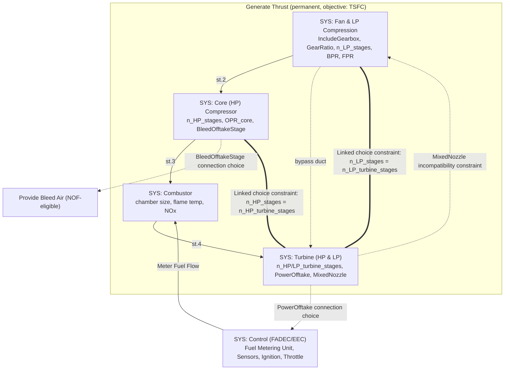

# Axioma: Turbofan Compressor Requirements & Full-Engine System Model (Amendment)

**Status:** Merged into `Axioma_requirements_v5.md` / `Axioma_implementation_v5.md` (Phase 0 doc-consolidation pass, 2026-08-27) — kept here for history, not superseded content. Both flagged reconciliation decisions (§2.1: Nozzle folded into Turbine, Inlet excluded from the SoI) were confirmed as documented during that merge. The ADR-011 numbering below is also confirmed (it keeps the number; see `Axioma_document_import_pipeline_amendment.md`'s own note on the ADR it was renumbered to).
**Basis:** `claude/Axioma_literature_extraction.md` (Bussemaker 2025, Tan et al. 2024, NASA SP-36). Bussemaker's DSG/ADSG methodology is used as the **primary** structuring framework per instruction; Tan et al. and NASA SP-36 ground the turbofan-specific and compressor-specific content within it.
**Scope of this amendment:** three parts — (1) new FR group for the Fan & LP Compression / Core (HP) Compressor subsystems, (2) a full ADSG-style system model for the turbofan pilot, reconciling Tan et al.'s decomposition into Axioma's already-resolved 5-subsystem structure (reqs v4 §5.5), and (3) the platform gaps this system model exposes — nothing in the current `Axioma_requirements_v4.md`/`Axioma_implementation_v4.md` actually specifies *how* Mode B represents an architecture design space, and Part 2 cannot be built, displayed, or edited in the platform as currently specified without the additions in Part 3.

---

# Part 1 — Fan & LP Compression / Core (HP) Compressor Requirements

## 1.1 New FR group: FR-COMP

Applies identically to both compressor subsystems (Fan & LP Compression, Core (HP) Compressor) — per Bussemaker's recursive, independently-instantiable `SYS` concept (literature extraction §2.2), each subsystem gets its own independent copy of these requirements, populated with subsystem-specific values.

| ID | Requirement Name | Description | Design | Test |
| :--- | :--- | :--- | :--- | :--- |
| **FR-COMP-01** | Over-all Design-Point Specification | Every compressor-subsystem Block carries a structured 9-field design-point specification (weight flow, over-all pressure ratio, equivalent speed, target efficiency, high-efficiency operating range, inlet/outlet diameters, max outlet velocity, length/weight targets, inlet distortion tolerance), populated by a human or by Mode B (tagged `source: ai-generated` per FR-CEM-04). | §1.4 below | impl §5 |
| **FR-COMP-02** | Off-Design Performance Map | Every compressor-subsystem Block carries a performance-map artifact (pressure ratio vs. equivalent weight flow, parametrized by equivalent speed, with an explicit stall/surge limit line) as the canonical representation of off-design behavior — not just the single design point from FR-COMP-01. | §1.4 below | impl §5 |
| **FR-COMP-03** | Blade-Loading & Mach Validation | The semantic-validation layer (FR-CORE-05) rejects a compressor-subsystem configuration whose stage loading (diffusion factor) or relative Mach number falls outside stated bounds without an explicit, human-acknowledged override — default bounds: diffusion factor ≲ 0.4, relative Mach number ≤ 1.2 (routine); values up to Mach 1.35 or D > 0.4 are accepted only with an explicit override flag, never silently. | §1.4 below | impl §5 |
| **FR-COMP-04** | Stage-Count Consistency | A compressor subsystem's stage count is linked, via a choice constraint (Part 2, §2.5), to the stage count of the turbine section that drives it — Fan & LP Compression ↔ LP Turbine, Core (HP) Compressor ↔ HP Turbine — so Mode B cannot generate an architecture instance with an inconsistent stage split across a shaft. | Part 2 §2.5 | impl §5 |
| **FR-COMP-05** | Gas-Generator Matching Interface | A compressor-subsystem Block exposes, at its ports, the parameters needed for 0D/1D gas-generator matching against the Combustor and its driving Turbine: equivalent weight flow, equivalent speed, bleed fraction `B`, and (for Core (HP) Compressor) the station-numbering convention in Part 2 §2.6. | Part 2 §2.6 | impl §5 |
| **FR-COMP-06** | Negotiable-Specification Flagging | If two or more fields of a compressor subsystem's FR-COMP-01 specification are found mutually incompatible (e.g., requested pressure ratio not achievable within the stated length/weight budget at the stated stage count), the specification is flagged for review, not silently adjusted or silently accepted — mirrors NASA SP-36's own framing that this 9-item set requires negotiation, not treatment as a fixed contract (literature extraction §3.1). | §1.4 below | impl §5 |

## 1.2 Why FR-COMP-01/02 aren't already covered by the Interface Contract (impl §2.6)

The existing Interface Contract schema (impl §2.6) has a generic "Performance targets" field ("Inlet temp 1650K, pressure ratio 4.2, 12,000 RPM" in its one worked example). That's necessary but not sufficient for a compressor: NASA SP-36's own account of compressor design requirements (literature extraction §3.1) makes clear that a compressor needs a **specific, named 9-field structure** (not a free-text performance-targets blob) plus a **map artifact**, not just a design point, because off-design behavior — stall margin, Reynolds-number effects at altitude, inlet distortion — is where compressor designs actually fail. FR-COMP-01/02 make that structure explicit rather than leaving it to whatever a human or Mode B happens to write into a generic field.

## 1.3 Extended Interface Contract examples (extends impl §2.6 table)

| Field | Fan & LP Compression (example) | Core (HP) Compressor (example) |
| :--- | :--- | :--- |
| Performance targets (FR-COMP-01) | Design weight flow, BPR, FPR [1.1–1.8], design equivalent speed, target η_poly, high-η range = 70–105% N/√θ | Design weight flow, OPR contribution, design equivalent speed, target η_poly, high-η range |
| Off-design map (FR-COMP-02) | PR vs. w√θ/δ map, parametrized by N/√θ, with stall line | Same, for the core spool |
| Boundary conditions | Inlet distortion tolerance, altitude/Mach envelope, Reynolds-number floor at altitude | Combustor-inlet temperature/pressure environment |
| Geometric envelope | Fan diameter, LP-spool axial length budget, hub/tip ratio floor (~0.35, literature extraction §3.1) | Core diameter, HP-spool axial length budget |
| Interface/port definitions | Bypass duct port (to nozzle/mixer), LP-shaft coupling (to LP Turbine), gearbox port (if `IncludeGearbox`) | Bleed-air offtake port (location per FR-COMP-stage-selection, Part 2 §2.4), HP-shaft coupling (to HP Turbine), combustor-inlet port |
| Mass/cost targets | Stage/blade mass ≤ budget, unit cost envelope | Same, core-spool scope |
| Material/process constraints | Blade material vs. relative-Mach/thermal duty (FR-COMP-03 bound) | Same, higher-temperature duty than the LP spool |

## 1.4 Design reference — §5.14 (new section for `Axioma_requirements_v4.md`)

**Over-all Specification schema (FR-COMP-01)** — a structured field set, not free text, stored the same way any other structured element body is stored (document store, per NFR-DATA-02): design weight flow; design over-all pressure ratio; design equivalent speed; target efficiency; operating range for sustained high efficiency; inlet/outlet diameters; maximum outlet velocity; target length/weight; inlet-distortion tolerance. Source: NASA SP-36 p.108's 9-item list (literature extraction §3.1, §6 — verified location, previously mis-cited as p.109).

**Performance-map artifact (FR-COMP-02)** — represented using the Parametrics machinery already proposed in `Axioma_gap_closure_amendment.md` §1.1 (FR-PARAM group): the map's governing relations (continuity/energy/equilibrium-derived, per NASA SP-36 Ch. III) are Constraints; equivalent weight flow and equivalent speed are bound Parameters; the map itself is best represented as a **sampled/tabulated Constraint output** (a family of PR-vs-flow curves at fixed N/√θ) rather than a single closed-form equation, since NASA SP-36's own equations for this are not reliably recoverable (literature extraction §5) — Axioma should source the actual constitutive relations from a modern reference or from `cem-core`'s own 0D model (Part 3), using NASA SP-36 only for the map's *shape/parametrization*, not its buried equation bodies.

**Blade-loading/Mach bounds (FR-COMP-03)** — diffusion factor ≲ 0.4 and relative Mach ≤ 1.2 (routine)/1.35 (demonstrated-extended, override-only) are validation thresholds in `sysml-core`'s semantic-validation layer (FR-CORE-05), evaluated the same way "containment acyclicity" or "type-legal relationship endpoints" are — a hard gate unless explicitly overridden by a human, logged like any other override (consistent with NFR-COMP-04 audit-readiness). Source: NASA SP-36 Ch. II/III (literature extraction §3.1, §3.4).

---

# Part 2 — Full Engine System Model (ADSG methodology, primary source: Bussemaker 2025)

## 2.0 Method note

This model is built using Bussemaker's bottom-up, function-based process (literature extraction §2.3: identify boundary functions → decide each function's fulfillment mechanism → add incompatibility/choice constraints only where needed → group into subsystems → characterize → add ports → iterate → define metrics), rather than a top-down fixed-tree decomposition — per Bussemaker's own finding that bottom-up needs materially fewer ad-hoc cross-tree constraints (literature extraction §2.3, p.145). Axioma's 5-subsystem split (reqs v4 §5.5) is **already a resolved decision**, not re-litigated here — it is realized below as five `SYS` grouping nodes, each populated bottom-up from its own boundary sub-functions.

## 2.1 Reconciliation with Tan et al.'s decomposition (explicit decision, not silent divergence)

Tan et al. use a coarser 3-subsystem split — Fuel Supply System, Engine Control System, Thrust Generation System, with Compressor/Combustor/Turbine/Bleed/Nozzle/Afterburner/Inlet/Heat-Exchanger all nested inside Thrust Generation System (literature extraction §1). Axioma's resolved 5-subsystem split promotes Compressor/Combustor/Turbine to independent top-level subsystems. Reconciling the two, component by component:

| Tan et al. component | Axioma subsystem home | Rationale |
| :--- | :--- | :--- |
| Compressor (split into Fan + Core here) | Fan & LP Compression / Core (HP) Compressor | Direct promotion, per reqs v4 §5.5 |
| Burner | Combustor | Direct promotion |
| Turbine | Turbine (HP & LP) | Direct promotion |
| FCU, Sensors/Monitors, Ignition Control, Throttle Control, FADEC | Control (FADEC/EEC) | Direct match — this is exactly Axioma's 5th subsystem |
| Fuel Pumps, Fuel Lines, Fuel Tanks, Fuel Injectors | **Split**: Fuel Injectors → Combustor (physically inside the combustor boundary); Fuel metering/scheduling logic → Control (FADEC/EEC), as the "Meter Fuel Flow" function it already induces; Fuel Tanks/Lines/Pumps → **flagged out of the engine System-of-Interest** (airframe-owned, not an engine subsystem) unless a future pilot phase pulls the fuel system inside the SoI boundary | Tan et al.'s aircraft-level SoI includes the fuel tank; Axioma's SoI (per CLAUDE.md) is the engine itself — the tank is a boundary condition, not a subsystem, for this pilot |
| Bleed | Core (HP) Compressor (offtake origin) ↔ Control (FADEC/EEC) (offtake scheduling) — modeled as a connection choice, not owned by one subsystem (Part 2 §2.4) | Bleed is inherently a cross-subsystem port, matching Bussemaker's own treatment (literature extraction §4.1, "Provide Bleed Air... fulfilled via connection-choice ports") |
| Nozzle | **Flagged decision**: modeled as the Turbine (HP & LP) subsystem's downstream exit port/boundary, not a 6th subsystem | Keeps the 5-subsystem count from reqs v4 §5.5 intact; nozzle geometry choices (mixed vs. separate flow) are modeled as a connection/incompatibility choice spanning Fan & LP Compression's bypass duct and Turbine's core exit (§2.4), matching Bussemaker's own exact mechanism (literature extraction §4.1) |
| Inlet | **Flagged decision**: treated as external to the engine SoI (airframe/nacelle-owned), appearing only as a boundary condition (inlet recovery, distortion) on Fan & LP Compression's upstream port | Matches NASA SP-36 Ch. XVII's own treatment of inlet recovery as an external map multiplied into the matching, not part of the gas generator (literature extraction §3.3) |
| Heat Exchanger | Not modeled in this pilot pass — flagged as a future `NOF` (non-fulfillment) option on Control (FADEC/EEC) or Core (HP) Compressor if a thermal-management trade study is later needed | No current Axioma requirement calls for it; adding it speculatively would violate Bussemaker's own caution against unjustified modeling complexity (literature extraction §2.7) |

**Both flagged decisions above (Nozzle, Inlet) are choices this amendment is making explicitly, not defaults inherited from either source — they should be confirmed, not assumed, before this section is folded into the requirements doc.**

## 2.2 Boundary functions (top level)

Following Bussemaker's rule that boundary functions are solution-neutral "[process] [operand]" phrases derived from top-level requirements (literature extraction §2.3, step 1):

| Function (FUN) | Permanence | Fulfillment mechanism | Notes |
| :--- | :--- | :--- | :--- |
| **Generate Thrust** | Permanent (primary value path) | Decomposed (`DE`) into the five-subsystem gas-path chain below | Carries the primary objective metric (TSFC or specific thrust) |
| **Provide Bleed Air** | Conditional | Non-fulfillment-eligible (`NOF`) — an aircraft variant may not need engine bleed | Fulfilled via a connection choice from Core (HP) Compressor's offtake port |
| **Provide Accessory/Shaft Power** | Conditional | `NOF`-eligible | Fulfilled via a connection choice from a shaft-mounted offtake port (HP or LP shaft, §2.4) |
| **Regulate Engine Operation** | Permanent | Fulfilled directly by one component (`COMP`), no choice — Control (FADEC/EEC) is a fixed, resolved part of the architecture (reqs v4 §5.5), not an alternative being searched over | Induces **Meter Fuel Flow** as a sub-function (fulfilled by a Fuel Metering Unit component inside Control) |

**Generate Thrust's decomposition** satisfies Bussemaker's parallelism/solution-neutrality/compatibility test for using `DE` (literature extraction §2.3): the gas-path stages have a real execution order (intake → LP compression → HP compression → combustion → HP/LP expansion → exhaust), so this is consciously **not** modeled as a naive top-down decomposition (which the thesis found needs many ad-hoc constraints) — instead each stage is a `SYS` subsystem connected to the next by a fixed gas-path port chain, with the *choices* living inside and at the boundaries of each subsystem, not in the decomposition itself. This mirrors how Bussemaker's own jet-engine benchmark and ADORE reformulation are actually structured (literature extraction §2.5): a fixed thermodynamic-cycle skeleton with architecture choices layered on top, not a freely-recombinable component soup.

## 2.3 Per-subsystem breakdown

Each subsystem below is a `SYS` node per Bussemaker's ADSG (recursively instantiable, independent internal choices — literature extraction §2.2). Design-variable bounds are illustrative starting points, adapted from Bussemaker's own jet-engine benchmark (`SIMPLE_TURBOFAN_ARCH`, literature extraction §2.5, PDF p.94) where a direct analogue exists, and from NASA SP-36 where compressor-specific bounds exist (literature extraction §3.1, §3.4).

### Fan & LP Compression

| Element | Type | Detail | Source |
| :--- | :--- | :--- | :--- |
| `IncludeGearbox` | Selection choice (bool) | Direct-drive vs. geared fan | Bussemaker PDF p.94 (`IncludeGearbox`) |
| `GearRatio` | Design variable, conditional on `IncludeGearbox` | Continuous, [1.0–5.0] | Bussemaker PDF p.94 |
| `n_LP_stages` | Design variable (integer) | Fan + LP-compressor stage count; linked to LP Turbine stage count (§2.5) | Bussemaker's stage-count choice-constraint pattern (PDF pp.158-161), applied to Axioma's split |
| `BPR` | Design variable | Continuous, [2.0–12.5] | Bussemaker PDF p.94 |
| `FPR` | Design variable | Continuous, [1.1–1.8] | Bussemaker PDF p.94 |
| Over-all specification (FR-COMP-01) | Characterization | 9-field spec | NASA SP-36 p.108 |
| Diffusion factor / relative Mach bound | Design constraint | D ≲ 0.4, Mach ≤ 1.2 routine | NASA SP-36 pp.57, 93 |
| Bypass-duct exit port | Port (`OUT`) | Feeds the Nozzle connection choice (§2.4) | Reconciliation §2.1 |

### Core (HP) Compressor

| Element | Type | Detail | Source |
| :--- | :--- | :--- | :--- |
| `n_HP_stages` | Design variable (integer) | Linked to HP Turbine stage count (§2.5) | Bussemaker pattern, PDF pp.158-161 |
| `OPR_core` | Design variable | Continuous; combines with Fan & LP Compression's contribution toward overall `OPR` [1.1–60.0] | Bussemaker PDF p.94 (`OPR`) |
| `BleedOfftakeStage` | Selection choice | ∈ {1..`n_HP_stages`} | Bussemaker PDF p.94 (`BleedOfftake`), direct analogue |
| Over-all specification (FR-COMP-01) | Characterization | 9-field spec | NASA SP-36 p.108 |
| Diffusion factor / relative Mach bound | Design constraint | Same bounds, higher duty | NASA SP-36 pp.57, 93 |
| Bleed-air offtake port | Port (`OUT`) | Feeds "Provide Bleed Air" via connection choice | Reconciliation §2.1 |
| Combustor-inlet port | Port (`OUT`) | Fixed connection to Combustor | — |

### Combustor

| Element | Type | Detail | Source |
| :--- | :--- | :--- | :--- |
| Fuel-injector port | Port (`IN`) | Fixed connection from Control's Fuel Metering Unit | Reconciliation §2.1 |
| Chamber sizing, flame temperature, pressure loss, NOx | Design variables / metrics | Generic metric role unless made an explicit objective/constraint | Tan et al. engineering-parameter list |
| No architecture choice modeled in this pass | — | Deliberately minimal — avoids unjustified modeling complexity (Bussemaker's own caution, literature extraction §2.7) | — |

### Turbine (HP & LP)

| Element | Type | Detail | Source |
| :--- | :--- | :--- | :--- |
| `n_HP_turbine_stages` | Design variable (integer) | Linked to Core (HP) Compressor via choice constraint (§2.5) | Bussemaker pattern |
| `n_LP_turbine_stages` | Design variable (integer) | Linked to Fan & LP Compression via choice constraint (§2.5) | Bussemaker pattern |
| `PowerOfftake` | Selection choice | ∈ {HP shaft, LP shaft} | Bussemaker PDF p.94 (`PowerOfftake`), direct analogue |
| `MixedNozzle` | Selection choice, spans Turbine's core-exit port and Fan & LP Compression's bypass-duct port | bool — mixed vs. separate-flow exhaust | Bussemaker PDF p.94 (`MixedNozzle`); modeled via incompatibility constraint per Bussemaker's own ADORE reformulation (literature extraction §4.1, "incompatibility constraint between mixed-nozzle and separate-core/bypass-nozzle fulfillment options") |
| Core-exit / nozzle port | Port (`OUT`) | Terminates "Generate Thrust"; carries the objective metric | Reconciliation §2.1 (nozzle folded in here) |

### Control (FADEC/EEC)

| Element | Type | Detail | Source |
| :--- | :--- | :--- | :--- |
| Fuel Metering Unit | Component (`COMP`), induced by "Meter Fuel Flow" | Fixed, no architecture choice | Tan et al. (FCU) |
| Sensors/Monitors, Ignition Control, Throttle Control | Components | Fixed | Tan et al. |
| Accessory/generator connection | Port (`IN`), receives from Turbine's `PowerOfftake` via connection choice | — | §2.4 |

## 2.4 Cross-cutting connection choices and constraints

| Element | Type | Cardinality / Rule | Source |
| :--- | :--- | :--- | :--- |
| **Bleed-air routing** | Connection choice | Core (HP) Compressor `BleedOfftakeStage` port → external ECS/airframe port (single connection) | Bussemaker's exact "Provide Bleed Air... connection-choice ports" mechanism (literature extraction §4.1) |
| **Power-offtake routing** | Connection choice | Turbine `PowerOfftake` (HP or LP shaft) → Control (FADEC/EEC) accessory port | Bussemaker's exact "Provide Power... connection-choice ports" mechanism (literature extraction §4.1) |
| **Nozzle-flow exclusivity** | Incompatibility constraint | `MixedNozzle=true` excludes independently-configured separate core/bypass nozzle fulfillment, and vice versa | Bussemaker's exact mechanism, literature extraction §4.1 |

## 2.5 Choice constraints (stage-count consistency, FR-COMP-04)

| Constraint | Type | Rule |
| :--- | :--- | :--- |
| LP-spool stage consistency | Linked (`=`) choice constraint | `n_LP_stages` (Fan & LP Compression) = `n_LP_turbine_stages` (Turbine) |
| HP-spool stage consistency | Linked (`=`) choice constraint | `n_HP_stages` (Core (HP) Compressor) = `n_HP_turbine_stages` (Turbine) |

Direct application of Bussemaker's own worked example: "Compressor/Shaft/Turbine each get instantiation choices... linked via a choice constraint so stage counts stay consistent across the three component types" (literature extraction §4.1, PDF pp.158-161).

## 2.6 Station numbering (FR-COMP-05, gas-generator matching interface)

Adopted from NASA SP-36 Ch. XVII's two-spool convention (literature extraction §3.3, PDF p.489), as the port-numbering scheme for 0D/1D matching between the four gas-path subsystems:

`0` ambient → `1` Fan/LP-compressor inlet → `2` Fan/LP-compressor exit / Core-compressor inlet → `3` Core-compressor exit / Combustor inlet → `4` Combustor exit / HP-turbine inlet → `5` HP-turbine exit / LP-turbine inlet → `6` LP-turbine exit → `7` nozzle inlet → `8` nozzle exit.

## 2.7 Metrics

| Metric | Role | Attached to (permanent element) | Source |
| :--- | :--- | :--- | :--- |
| TSFC | Objective (minimize) | "Generate Thrust" function | Bussemaker jet-engine case study, literature extraction §2.5 |
| Thrust | Constraint or secondary objective | "Generate Thrust" | Tan et al., Bussemaker |
| Weight/mass | Objective or constraint | System-level | Bussemaker, both jet-engine and HEP case studies |
| Jet Mach number | Constraint, ≤ 1.0 | Turbine core-exit port | Bussemaker PDF p.94 |
| Sum of shaft pressure-ratio factors | Constraint, ≤ 0.9 | System-level | Bussemaker PDF p.94 |
| Per-stage max pressure ratio | Constraint, ≤ 15.0 | Fan & LP Compression, Core (HP) Compressor | Bussemaker PDF p.94 |
| Diffusion factor | Constraint, ≲ 0.4 | Fan & LP Compression, Core (HP) Compressor | NASA SP-36 (FR-COMP-03) |
| Relative Mach number | Constraint, ≤ 1.2 (routine) | Fan & LP Compression, Core (HP) Compressor | NASA SP-36 (FR-COMP-03) |
| NOx emission | Generic metric (verification-only, unless made an objective) | Combustor | Tan et al. |

## 2.8 System model diagram



## 2.9 Bridging note — how this maps onto Axioma's actual SysML v2 graph

Bussemaker's own recommendation (literature extraction §2.2, verified verbatim quote): *"ADORE functions can be mapped to SysMLv2 actions, components to parts, selection choices to variation definitions, design problems to trade studies, and generated architectures to trade study alternatives."* Applied to Axioma's existing node/edge set (CLAUDE.md, impl §2.3):

| ADSG concept (this model) | Axioma graph today | Gap? |
| :--- | :--- | :--- |
| Component / subsystem (`COMP`, `SYS`) | `:Structure` | Covered — no change needed |
| Port (`IN`/`OUT`) | `:Port` | Covered |
| Function (`FUN`) — architecture-generation function, distinct from an executable fUML Action | Nothing | **Gap** — see Part 3 |
| Selection choice, `DE`, `MULTI`, `NOF`, `CON` | Nothing | **Gap** — see Part 3 |
| Connection choice, connector cardinality | Nothing (`:Port` exists but no choice/cardinality-resolution mechanism) | **Gap** — see Part 3 |
| Incompatibility constraint, choice constraint | Nothing | **Gap** — see Part 3 |
| Design variable | `:Parameter` (from gap-closure amendment, FR-PARAM) — close but not role-tagged for optimization | **Partial gap** — see Part 3 |
| Metric (objective/constraint/generic role) | `:Requirement`, or a Parametrics `:Constraint` output — neither carries an explicit optimization-role tag | **Partial gap** — see Part 3 |
| Architecture instance (a resolved design vector) | A candidate `:Structure` subgraph tagged `source: ai-generated` (FR-CEM-04) | Mostly covered, but no first-class "instance list" comparable across candidates — see Part 3 |

---

# Part 3 — Missing Platform Components

**Headline finding:** `Axioma_requirements_v4.md`/`Axioma_implementation_v4.md` currently say Mode B "generates/optimizes allocation of Blocks and interfaces... via 0D/1D performance and mass-budget models" (FR-CEM-02) but **do not specify the design-space representation Mode B actually searches over.** Part 2 of this amendment is only buildable, displayable, and editable in the platform once that representation exists. This is not a small gap — it is a new subsystem of the platform, comparable in scope to the fUML/Alf decision the team already made for behavioral simulation (ADR-005), and deserves the same honest framing: **it should not be assumed to fit inside the existing P2.1 timeline without re-estimating it.**

## 3.1 New FR group: FR-ARCH (extends Product 2 / Mode B, CEM §2.2)

| ID | Requirement Name | Description | Design | Test |
| :--- | :--- | :--- | :--- | :--- |
| **FR-ARCH-01** | Function-to-Form Modeling | A user (or Mode B, drafting) can model architecture-generation functions (`FUN`) and their fulfillment via component (`COMP`), decomposition (`DE`), multi-fulfillment (`MULTI`), non-fulfillment (`NOF`), or concept-narrowing (`CON`) nodes, distinct from fUML Actions used for behavioral execution (FR-CORE-04). | §3.2 | impl §5 |
| **FR-ARCH-02** | Selection Choice Modeling | A user can define a selection choice (pick-one-of-N) over option nodes, with derivation edges expressing "if selected, these elements exist," including cyclic derivation (e.g., mutually-dependent Compressor/Combustor/Turbine existence). | §3.2 | impl §5 |
| **FR-ARCH-03** | Connection Choice Modeling | A user can define a connection choice between a set of source ports and target ports, with cardinality rules (list/range/lower-bound-only), resolved after selection choices. | §3.2 | impl §5 |
| **FR-ARCH-04** | Incompatibility & Choice Constraints | A user can define an incompatibility constraint (mutual exclusion) between two elements/choices, or a choice constraint (Linked/Permutations/Unordered [non-]replacing combinations) across a set of choices. | §3.2 | impl §5 |
| **FR-ARCH-05** | Design Vector Encode/Decode | `cem-core` can encode a resolved (or partially resolved) architecture into a design vector and decode a design vector back into a graph instance, using problem-specific correction by default (per Bussemaker's own finding that generic correction rarely helps — literature extraction §2.4) with a generic fallback available. | §3.3 | impl §5 |
| **FR-ARCH-06** | Design-Space Health Metrics | `cem-core` computes and exposes Imputation Ratio, Correction Ratio, Correction Fraction, and Max Rate Diversity for any defined design space, before an expensive optimization run is launched. | §3.3 | impl §5 |
| **FR-ARCH-07** | Architecture Instance Generation & Comparison | Mode B runs produce a browsable, comparable set of architecture instances (candidate Blocks/subgraphs), each carrying the same provenance as any other AI-generated element (FR-CEM-04/05) and enterable into the existing proposal/review-gate flow (`/cem/proposals/*`, FR-CEM-07) — not a separate approval mechanism. | §3.4 | impl §5 |
| **FR-ARCH-08** | Non-Convergent Evaluation Handling | When a candidate architecture's evaluation does not converge (thermodynamic-cycle non-convergence, per Bussemaker's ~50% observed rate on a comparable jet-engine problem — literature extraction §2.4), `cem-core` treats this as a typed, non-fatal outcome usable by the optimizer (e.g., a Probability-of-Viability signal) rather than a hard failure — reusing the existing solver-result-state pattern from FR-CEM-13 rather than inventing a second failure taxonomy. | §3.3 | impl §5 |

## 3.2 Data-model additions (extends impl §2.3, alongside the gap-closure amendment's additions)

| Addition | Type | Notes |
| :--- | :--- | :--- |
| `:Function` | Node label | Architecture-generation function (`FUN`), distinct from executable fUML Actions |
| `:SelectionChoice`, `:ConnectionChoice` | Node labels | Choice nodes; resolution state (unresolved/partial/resolved) is a property |
| `derives` | Edge type | Directed, cycles permitted (NFR-REL-02 already allows this) — the DSG derivation edge |
| `incompatibleWith` | Edge type | Undirected-semantics incompatibility constraint |
| `choiceConstraint` | Edge/node (hyper-edge over ≥2 choices) | Carries constraint type: Linked / Permutations / Unordered [non-]replacing |
| Optimization-role tag | Property on `:Requirement` / `:Constraint` (from FR-PARAM) | `objective` / `constraint` / `generic`, plus permanence flag |
| Fulfillment-mechanism tag | Property on `:Function`↔`:Structure` edges | `DE` / `MULTI` / `NOF` / `CON` / direct `COMP` |

All new write paths pass through the existing semantic-validation layer (§4.2 impl) — no new bypass, consistent with how the gap-closure amendment handled its own additions.

## 3.3 `cem-core` gaps (currently described only as "deterministic 0D/1D models, mass-budget solver, allocation optimizer," impl §2.1)

- **Encoder/decoder implementation** — selection-choice and connection-choice encoders (pattern-specific → eager → lazy → ordinal, per Bussemaker's preference order, literature extraction §2.2) do not exist. Recommendation: evaluate **SBArchOpt** (Bussemaker's own open-sourced `pymoo`-based library, literature extraction §2.4) as an adopt-vs-build decision, the same way ADR-005 evaluated fUML engines — this is directly analogous groundwork, not a fresh survey.
- **Hierarchical sampling / DoE generation** — not specified at all today; needed before any optimization run (literature extraction §2.4).
- **Optimizer algorithm selection** — NSGA-II vs. hierarchical Bayesian Optimization, and the integration-level decision (Naive / Correction+imputation / Explicit activeness-aware) that Bussemaker found materially affects BO performance (89–149% penalty when ignored, literature extraction §2.4) — none of this is in `cem-core`'s current description.
- **Probability-of-Viability / hidden-constraint handling** (FR-ARCH-08) — the raw signal already exists (FR-CEM-13's typed solver results), but nothing currently wires it into an optimizer-facing viability classifier.

## 3.4 API gaps (extends impl §1.2)

```
POST /cem/mode-b/design-space              — define/version an ADSG-style design-space model (functions, choices, constraints)
GET  /cem/mode-b/design-space/{id}/stats    — IR / CR / CRF / MRD (FR-ARCH-06)
POST /cem/mode-b/design-space/{id}/resolve  — resolve one selection/connection choice, returns updated (partial) instance
GET  /cem/mode-b/instances?runId=           — browsable, comparable architecture instances from a Mode B run (FR-ARCH-07)
POST /cem/mode-b/instances/{id}/propose     — enter an instance into the existing /cem/proposals/* review gate (FR-CEM-07)
```

## 3.5 `diagram-engine` / UI gaps (extends impl §4.3, currently Block/Port/Requirement/Hazard/Mission node types only)

- New React Flow node types: `SelectionChoiceNode`, `ConnectionChoiceNode`, `FunctionNode` — need their own provenance-chrome treatment (origin/validation/staleness, §6.3 impl) since they'll be AI-suggested as often as human-authored.
- A choice-resolution interaction: click a choice node → pick an option (or let Mode B pick) → graph rewrites per Bussemaker's 4-step resolution procedure (literature extraction §2.2) — this is new canvas interaction logic, not covered by the existing "select a Block, see its Hazards/traceability" flow (impl §6.1).
- A design-space stats sidebar (IR/CR/CRF/MRD, mirroring ADORE's own "architecture-choices list," literature extraction §2.2) — no current panel plays this role; closest existing analog is the Hazard/Risk matrix panel (impl §4.3), which is a reasonable pattern to reuse structurally.
- An architecture-instances list view (candidate comparison, promotable to proposal) — closest existing analog is FR-CEM-15's Campaign/Pareto comparison UI (for Mode C solver results), which this should probably share a component with rather than building a second comparison UI.

## 3.6 New ADR candidate

| ADR | Decision needed | Status |
| :--- | :--- | :--- |
| **ADR-011** | Mode B design-space representation: adopt an ADSG-equivalent (DSG/ADSG concepts per Bussemaker) as the modeling layer for FR-ARCH-01…04, and evaluate SBArchOpt/`pymoo` as a `cem-core` dependency vs. building the encoder/optimizer stack in-house — same build-vs-adopt shape as ADR-005 (fUML/Alf), and should get the same kind of survey before committing. | Proposed |

## 3.7 Roadmap placement

None of Part 3 is buildable before Product 1's core graph exists (P1.1) and shouldn't block it. Recommended placement, extending impl §4.1:

- **P2.1 (Mode B, Mo 7–9):** FR-ARCH-01…06 and ADR-011 belong here — this *is* what "Mode B: `cem-core` deterministic optimizer; trade-study runner" (impl §4.1) currently under-specifies. Recommend re-scoping P2.1's estimate once ADR-011 is resolved, rather than assuming the existing Mo 7–9 window absorbs this.
- **P2.1–P2.2:** FR-ARCH-07/08 (instance generation/comparison, non-convergent handling) — natural fit alongside "proposal/branch workflow" already scheduled in P2.2.
- **P2.1–P2.2:** `diagram-engine` additions (§3.5) — UI work follows once the schema (§3.2) and API (§3.4) exist; sequence after those within the same phase window, not a separate phase.

---

## Suggested next steps

1. **Confirm the two flagged reconciliation decisions** (§2.1: Nozzle folded into Turbine, Inlet excluded from the engine SoI) before this is folded into `Axioma_requirements_v4.md`.
2. **Run ADR-011's survey** (SBArchOpt/`pymoo` adopt-vs-build) before P2.1 estimation — mirrors how ADR-005's survey materially changed the fUML/Alf plan.
3. **Source real 0D/1D equations** for the compressor performance map (FR-COMP-02) and gas-generator matching (FR-COMP-05) from a non-OCR'd reference or `pyCycle` (both flagged already in `claude/Axioma_literature_extraction.md` §1, §4) — NASA SP-36 gives the map's *shape*, not usable closed-form equations.
4. Consider whether **FR-ARCH** should be its own top-level section in the requirements doc (like FR-CEM) or nested under §2.2 as a sub-group — it's large enough to argue either way.
